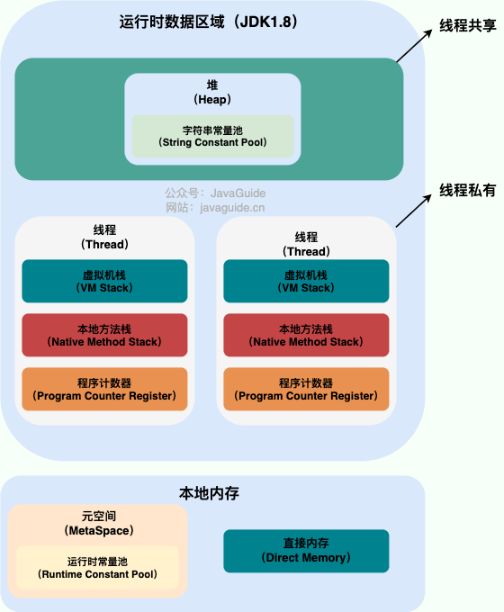
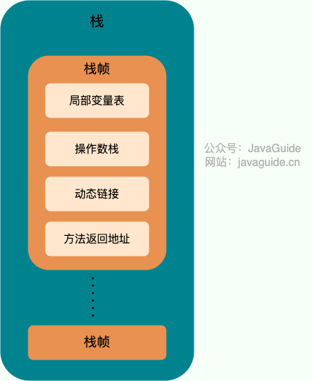

# 深入理解Java虚拟机：内存区域

## 一、 Java进程内存总览：堆内与堆外

当我们启动一个Java程序时，操作系统会为这个Java虚拟机（JVM）进程分配一块内存（例如10GB）。这是该Java进程所能使用的**内存上限**。

我们可以把这块总内存想象成一个大蛋糕。JVM会按照规则将这个蛋糕切分成两大块：**堆内内存** 和 **堆外内存**。

```text
+-----------------------------------------------------------------------------+
|                              Java 进程内存                                |
|                  (由操作系统管理, e.g., 10GB)                             |
+-----------------------------------------------------------------------------+
|                                                                             |
|  +----------------------------------+  +------------------------------------+
|  |       堆内内存 (Java Heap)         |  |       堆外内存 (Native Memory)     |
|  |      (GC管理, -Xmx控制)          |  |     (除堆内内存以外的所有内存)     |
|  |----------------------------------|  |------------------------------------|
|  | - 新生代 (Eden, S0/S1)           |  |  +--------------------------------+  |
|  | - 老年代                         |  |  |       方法区 (元空间)          |  |
|  | - 字符串常量池 (JDK 7+)          |  |  |    - 运行时常量池            |  |
|  +----------------------------------+  |  +--------------------------------+  |
|                                      |  |  +--------------------------------+  |
|                                      |  |  |           线程私有区域         |  |
|                                      |  |  |    - Java 虚拟机栈           |  |
|                                      |  |  |    - 本地方法栈              |  |
|                                      |  |  |    - 程序计数器              |  |
|                                      |  |  +--------------------------------+  |
|                                      |  |  +--------------------------------+  |
|                                      |  |  |            直接内存            |  |
|                                      |  |  +--------------------------------+  |
|                                      |  |  - JIT代码缓存, GC数据等          |  |
|                                      |  +------------------------------------+
|                                                                             |
+-----------------------------------------------------------------------------+
```

---

## 二、 目录

- [一、 Java进程内存总览：堆内与堆外](#一-java进程内存总览堆内与堆外)
- [二、 目录](#二-目录)
- [三、 堆内内存 (Java Heap)](#三-堆内内存-java-heap)
  - [3.1 堆的内部结构](#31-堆的内部结构)
  - [3.2 对象的分配、晋升与动态年龄](#32-对象的分配晋升与动态年龄)
  - [3.3 字符串常量池 (String Constant Pool) 与堆内内存的关系](#33-字符串常量池-string-constant-pool-与堆内内存的关系)
  - [3.4 可能出现的异常](#34-可能出现的异常)
- [四、 堆外内存 (Native Memory)](#四-堆外内存-native-memory)
  - [4.1 线程私有区域](#41-线程私有区域)
    - [4.1.1 Java虚拟机栈 (Java Virtual Machine Stack)](#411-java虚拟机栈-java-virtual-machine-stack)
    - [4.1.2 本地方法栈 (Native Method Stack)](#412-本地方法栈-native-method-stack)
    - [4.1.3 程序计数器 (Program Counter Register)](#413-程序计数器-program-counter-register)
  - [4.2 方法区 (Method Area)](#42-方法区-method-area)
  - [4.3 直接内存 (Direct Memory)](#43-直接内存-direct-memory)
- [五、 关键概念辨析](#五-关键概念辨析)
  - [5.1 静态常量池 vs 运行时常量池](#51-静态常量池-vs-运行时常量池)
  - [5.2 运行时常量池 vs 字符串常量池](#52-运行时常量池-vs-字符串常量池)
  - [5.3 堆外内存与JVM参数](#53-堆外内存与jvm参数)

---

## 三、 堆内内存 (Java Heap)

堆内内存是JVM所管理的内存中最大的一块，由所有线程共享，其**唯一目的就是存放对象实例**。几乎所有的对象实例和数组都在这里分配内存。堆内内存也是垃圾收集器（GC）管理的主要区域，因此也被称为“GC堆”。



### 3.1 堆的内部结构

现代垃圾收集器大多采用分代收集算法，因此堆内内存内部还可以细分为：
-   **新生代 (Young Generation)**：
    -   **Eden区**：大多数新创建的对象会在这里分配。
    -   **Survivor区 (From/To)**：存放经过一次或多次Minor GC后仍然存活的对象。
-   **老年代 (Old Generation)**：存放长期存活的对象。

### 3.2 对象的分配、晋升与动态年龄

新对象首先在Eden区分配，当Eden区满时会触发Minor GC。存活的对象会被移动到Survivor区，并且年龄加1。当对象的年龄达到一定阈值（默认为15）时，就会被晋升到老年代。

这个年龄阈值是动态的。如果某一年龄的对象总大小超过了Survivor空间的一半，那么大于或等于该年龄的对象就会被直接晋升到老年代。

<details>
<summary><strong>为什么需要这个动态年龄判断机制？（点击展开）</strong></summary>

> 这是JVM垃圾回收器的一种**自我调节和优化策略**，其根本目的是为了**保证Survivor区的稳定，防止其被填满**，从而避免大量对象因空间不足而被直接“挤”进老年代。
>
> 1.  **Survivor区的使命**：它的核心任务是作为“缓冲带”，用来识别出哪些对象是真正长期存活的。JVM希望对象能在这里经历多次GC，淘汰掉大部分“短命”对象，从而减少进入老年代的对象数量，降低Full GC的频率。
> 2.  **潜在的风险**：如果在某次Minor GC后，存活的对象数量激增，尤其是某一个年龄段的对象占用了Survivor区的大量空间（例如超过一半），JVM就会预判到风险。它必须为下一次Minor GC后从Eden区和另一个Survivor区存活下来的对象**预留足够的空间**。
> 3.  **动态调整策略**：如果JVM不做调整，下一次Minor GC后很可能因为Survivor区空间不足，导致大量本该留在年轻代的对象被提前晋升到老年代。这种“空间分配担保失败”的情况会污染老年代，加速Full GC的到来。因此，JVM采取了这种保守的动态策略：当发现某一年龄的对象总和已经超过Survivor空间的一半时，就将这个年龄及以上的对象立即晋升到老年代，从而释放出足够的空间，确保下一次GC的顺利进行。
>
> 简而言之，这个机制是为了“牺牲”一部分即将成年的对象，来换取整个年轻代垃圾回收体系的健康和高效。

</details>

### 3.3 字符串常量池 (String Constant Pool) 与堆内内存的关系

从JDK 1.7开始，字符串常量池从永久代移动到了**堆内内存**中。

<details>
<summary><strong>“移动到堆内内存”到底意味着什么？（点击展开）</strong></summary>

> 这并**不是**指在堆内内存中开辟了一块新的、独立的、叫做“字符串常量池”的物理区域。
>
> 而是指，那些被池化的字符串对象（例如 `String s = "abc";` 中的 `"abc"`），其对象实例和其他普通Java对象一样，被创建在**堆内内存**的**年轻代（Eden区）**。
>
> 这意味着，这些字符串对象也遵循标准的垃圾回收流程：它们可以在Minor GC后存活进入Survivor区，年龄不断增长，最终也可能晋升到老年代。字符串常量池本身可以理解为一个逻辑上的数据结构（类似一个HashTable），它持有对这些存放在堆内内存中字符串对象的引用。
>
> 所以，堆内内存的物理划分依然是您熟悉的年轻代和老年代，只是它现在也负责管理字符串常量池中的对象实例了。这样做的好处是，可以利用高效的年轻代GC及时回收不再使用的字符串，避免了永久代GC效率低下的问题。

</details>

### 3.4 可能出现的异常
-   `java.lang.OutOfMemoryError: Java heap space`
-   `java.lang.OutOfMemoryError: GC Overhead Limit Exceeded`

---

## 四、 堆外内存 (Native Memory)

堆外内存是一个广义的概念，指的是操作系统的内存中，**不属于堆内内存**的那部分。它包括**元空间、直接内存、线程栈、JIT代码缓存**，甚至JVM自身的C++代码和数据结构。

### 4.1 线程私有区域

这部分内存区域的生命周期与线程相同，随线程的创建而创建，销毁而销毁。它们本质上也是在堆外内存中实现的。

#### 4.1.1 Java虚拟机栈 (Java Virtual Machine Stack)



Java虚拟机栈（简称“栈”）为Java方法的执行提供服务。每个方法在执行时都会创建一个**栈帧(Stack Frame)**，用于存储局部变量表、操作数栈、动态链接、方法返回地址等信息。方法调用时入栈，方法结束后出栈。

**1. 栈帧的核心组件**
-   **局部变量表**：存放方法参数和局部变量。
-   **操作数栈**：执行字节码指令的工作区。
-   **动态链接**：将符号引用转换为直接引用的过程。
-   **方法返回地址**：记录调用者的PC寄存器值。

**2. 可能出现的异常**
-   `StackOverflowError`：线程请求的栈深度大于虚拟机所允许的深度。
-   `OutOfMemoryError`：如果虚拟机栈允许动态扩展，但在扩展时无法申请到足够的内存。

#### 4.1.2 本地方法栈 (Native Method Stack)

与虚拟机栈类似，但它为执行**本地方法(Native Method)**服务。在HotSpot虚拟机中，本地方法栈和Java虚拟机栈被合二为一。

#### 4.1.3 程序计数器 (Program Counter Register)

一块非常小的内存空间，可以看作是当前线程所执行字节码的**行号指示器**，或者说是下一条指令的地址。它是唯一一个在《Java虚拟机规范》中没有规定任何 `OutOfMemoryError` 情况的区域。

### 4.2 方法区 (Method Area)

方法区是所有线程共享的区域，它在逻辑上属于堆外内存。它用于存储已被虚拟机加载的**类信息、常量、静态变量**等数据。

**1. 方法区的实现：从永久代到元空间**

方法区是一个逻辑概念。在JDK 1.8之前，HotSpot虚拟机使用**永久代(PermGen)**实现。从JDK 1.8开始，永久代被**元空间(Metaspace)**取代，元空间使用的是**堆外内存**。

**2. 运行时常量池 (Runtime Constant Pool)**

运行时常量池是方法区的一部分，用于存放类加载后从`.class`文件转存过来的常量信息。具体解释见[5.1 静态常量池 vs 运行时常量池](#51-静态常量池-vs-运行时常量池)。

**3. 可能出现的异常**
-   `java.lang.OutOfMemoryError: Metaspace`
-   `java.lang.OutOfMemoryError: PermGen space` (JDK 1.8之前)

**4. 元空间内容详解**

这是一个常见误区集中的地方，下表清晰地列出了元空间到底存储了什么：

| 内容 | 是否在元空间 (Metaspace)？ | 准确位置和描述 |
| :--- | :--- | :--- |
| **类元信息** | **是 (核心)** | 类加载后在内存中生成的完整结构信息（类的“DNA图谱”）。 |
| **运行时常量池**| **是** | 类元信息的一部分，从.class文件加载而来。 |
| **静态变量** | **是** | 变量的引用本身与类信息存储在一起。但引用指向的对象实例在**堆内**。 |
| **`.class`文件** | **否** | 存在于**磁盘**上，是元空间数据的来源（相当于“建筑图纸”）。 |
| **JIT编译后的代码**| **否** | 存放在一个独立的堆外内存区域：**代码缓存 (Code Cache)**。 |

### 4.3 直接内存 (Direct Memory)

直接内存是堆外内存中一个**特殊且专用的部分**，是堆外内存的一个子集。Java程序可以通过NIO库中的`DirectByteBuffer`类来直接申请和使用这块内存，主要用于高性能I/O操作，避免在堆内内存和本地I/O设备之间来回复制数据。

**直接内存是线程共享的吗？**
> 是的。`DirectByteBuffer`对象本身存放在堆内内存上，可以像其他对象一样被多个线程共享。其引用的堆外直接内存是进程级别的，自然也可以被多个线程访问。但需要注意的是，**并发访问需要由应用程序自己保证线程安全**。

### 4.4 JIT 代码缓存 (JIT Code Cache)

即时编译器（Just-In-Time Compiler）是Java虚拟机实现“混合模式执行”（先解释后编译）的核心。它的主要作用是**将频繁执行的“热点”字节码编译为本地机器码（CPU直接执行的指令），并存储在代码缓存区，从而极大地提升Java程序的执行性能**。

**1. JIT的工作流程**

1.  **解释执行**：程序启动初期，JVM为了快速启动，会逐行解释字节码并执行。这个阶段性能较差。
2.  **热点探测**：JVM内部的分析器（Profiler）会监控代码执行，统计方法调用频率和循环次数。
3.  **JIT编译**：当某个方法或代码块达到“热点”阈值，JIT编译器就会介入，将其字节码编译成高效的本地机器码。
4.  **缓存与替换**：编译后的机器码被存入**代码缓存**（Code Cache，一片独立的堆外内存）。下次再执行这段代码时，JVM会直接使用缓存中的机器码，跳过解释步骤，实现性能飞跃。

**2. 示例：感受JIT的威力**

<details>
<summary><strong>点击展开查看演示代码与输出</strong></summary>

下面的代码可以清晰地展示JIT的优化效果：

```java
public class JitExample {

    public static long heavyCalculation() {
        long sum = 0;
        // 这是一个会被JIT盯上的“热点循环”
        for (int i = 0; i < 1_000_000_000; i++) {
            sum += i;
        }
        return sum;
    }

    public static void main(String[] args) {
        System.out.println("开始预热，触发JIT编译...");

        // 预热阶段：让JIT有时间发现并编译热点代码
        for (int i = 0; i < 10; i++) {
            long startTime = System.nanoTime();
            heavyCalculation();
            long endTime = System.nanoTime();
            // 打印每次执行耗时，单位：毫秒
            System.out.printf("第 %2d 次执行耗时: %d ms%n", (i + 1), (endTime - startTime) / 1_000_000);
        }
    }
}
```

**预期输出：**

```
开始预热，触发JIT编译...
第  1 次执行耗时: 310 ms
第  2 次执行耗时: 305 ms
第  3 次执行耗时: 299 ms
第  4 次执行耗时: 2 ms   <-- 性能突变！
第  5 次执行耗时: 1 ms
...
```
前几次执行是慢速的“解释执行”，当JIT编译完成后，后续执行耗时骤减，这就是执行本地机器码带来的巨大提升。
</details>

---

## 五、 关键概念辨析

### 5.1 静态常量池 vs 运行时常量池

这个区别是理解类加载和内存的关键。

-   **静态常量池 (Class File Constant Pool)**
    -   **位置**：存在于编译后的 **`.class` 文件**中，位于磁盘。
    -   **性质**：**静态的**、**不变的**。它是字节码的一部分，是一个“蓝图”或“模板”，描述了类、方法、字段的符号信息。它在程序运行前就已经存在。

-   **运行时常量池 (Runtime Constant Pool)**
    -   **位置**：存在于内存中的**方法区（元空间）**。
    -   **性质**：**动态的**。它是类加载后，JVM将`.class`文件中的静态常量池加载到内存中形成的。除了加载静态常量池的内容，程序在**运行期间**还可以将新的常量（如通过`String.intern()`）放入运行时常量池。

**总结**：静态常量池是`.class`文件里的“原材料”，运行时常量池是类加载后在内存（元空间）里创建的“实例”。

### 5.2 运行时常量池 vs 字符串常量池

这是一个极易混淆的点。它们是两个功能不同但紧密协作的组件。

-   **运行时常量池 (RCP)**
    -   **位置**：方法区（元空间）中。
    -   **角色**：**综合信息登记处**。它属于每个类，存储了该类的所有符号信息（类、方法、字段名）和字面量（字符串、数字等）。它是一个类级别的“信息蓝图”。

-   **字符串常量池 (SCP)**
    -   **位置**：JDK 7+ 在 **堆内内存** 中。
    -   **角色**：**全局字符串实例管理器**。它的目标是保证在整个JVM中，内容相同的字符串只有一个实例。它是一个全局的、专门用于字符串的“实例仓库”。

**它们如何协作？**

> 当JVM加载一个类时，代码中的字符串字面量（如`"hello"`）会作为信息存入该类的**运行时常量池(RCP)**。
>
> 当代码第一次需要使用这个`"hello"`对象时，JVM会进行一个“解析”操作：它会拿着RCP中的`"hello"`信息，去**字符串常量池(SCP)**进行查询和处理。
>
-   如果SCP中已有`"hello"`的实例，就直接返回其在堆内内存中的地址。
-   如果SCP中没有，就在堆内内存里创建一个`"hello"`实例，并将这个实例的地址登记到SCP中，然后返回该地址。
>
> `String.intern()`方法执行的也是同样的核心逻辑。（其实就是手动把jvm这个操作给做了）
>
> **总结**：RCP是每个类的“信息清单”，当清单上涉及到字符串时，JVM就会去全局唯一的SCP这个“实例仓库”里进行查找或注册，以实现字符串的复用。

<details>
<summary><strong>深度剖析：`public static final String a = "你好";` 到底发生了什么？</strong></summary>

> 这行代码涉及三个核心概念，它们位于不同的内存区域，扮演着不同的角色：
>
> 1.  **符号 "你好" (Symbolic Reference)**
>     -   **位置**：**元空间** 的 **运行时常量池(RCP)** 中。
>     -   **角色**：这是一个给编译器和类加载器看的**“名字”或“代号”**。它就像建筑图纸上的文字“盼盼牌防盗门”，它只是一个描述，并不代表真实的门。在编译阶段，JVM不需要知道这个字符串的真实内存地址，只需要记下这个符号即可。
>
> 2.  **引用 a (Reference)**
>     -   **位置**：**元空间** 的 **类元数据区域** 中（不属于RCP）。
>     -   **角色**：这是一个**变量“格子”**，作为类的静态字段存在。它就像门框，预留了安装一扇真实门的位置。这个“格子”里将要存放那扇门的真实地址。
>
> 3.  **对象 "你好" (Object Instance)**
>     -   **位置**：**Java堆** 中，由**字符串常量池(SCP)**管理。
>     -   **角色**：这是程序在运行时**真正使用的、独一无二的对象**。它就是那扇被真实安装到门框里的“盼盼牌防盗门”。它的**内存地址**（即**直接引用, Direct Reference**）会被填入元空间的`a`那个“格子”里。
>
> **流程总结：**
> JVM在类加载和解析时，会根据RCP中的**符号**，去Java堆的SCP中查找或创建**对象实例**，然后将该实例的**直接引用（内存地址）**，赋值给元空间中静态字段`a`这个**引用变量**。

</details>

### 5.3 常量辨析：`int` vs `Integer`

理解基本类型和包装类型的常量存储方式，同样有助于我们厘清堆和元空间的分工。

#### `public static final int a = 2;`

-   **`a` 是什么？** `a` 不是一个引用，它就是一个**基本数据类型**的字段。
-   **`2` 在哪里？** 对于这种编译期就能确定的常量（`static final`修饰的基本类型或字符串），Java会进行**常量折叠**优化。值 `2` 会被直接存放在 `.class` 文件的常量池里。
-   **加载后在哪里？** 类加载后，这个字段 `a` 和它的值 `2` 会作为类元数据的一部分，直接存储在**元空间**中。**这个过程完全不涉及Java堆**。

#### `public static final Integer a = 2;`

-   **`a` 是什么？** 这里的 `a` 是一个 `Integer` 类型的**引用**。作为静态字段，这个引用变量本身存储在**元空间**。
-   **`2` 在哪里？** 这行代码涉及**自动装箱(Autoboxing)**，编译器会将其转换为 `Integer a = Integer.valueOf(2);`。
-   **`Integer.valueOf(2)` 做了什么？** `Integer` 类内部维护了一个缓存池（默认缓存-128到127的`Integer`对象）。`Integer.valueOf(2)`会从这个缓存池中返回一个早已创建好的`Integer`对象实例。
-   **这个对象实例在哪里？** `Integer`缓存池中的所有对象都存储在**Java堆**中。

**结论：** `final Integer a = 2;` 中，`a` 是一个在元空间的引用，它指向了Java堆中`Integer`缓存池里的那个代表`2`的对象实例。

### 5.4 堆外内存与JVM参数

**堆外内存是否受JVM参数限制？**
> 答案是：**不直接受堆参数`-Xmx`控制，但整个进程的内存是相互关联且有限的。**
>
> 1.  Java进程作为一个操作系统级别的进程，它能使用的**总内存**量受限于操作系统和硬件。
> 2.  我们常用的JVM参数是用来**划分**这块总内存的：
>     -   `-Xmx` / `-Xms`: 设定 **堆内内存** 的大小。
>     -   `-XX:MaxMetaspaceSize`: 设定 **元空间** 的最大值。
>     -   `-XX:MaxDirectMemorySize`: 设定 **直接内存** 的最大值。
> 3.  可以把Java进程的总内存看作一个大蛋糕。`-Xmx`切走一块给堆内内存，`-XX:MaxMetaspaceSize`切走一块给元空间。**堆外内存就是剩下的所有部分**，包括直接内存和JVM自身运行所需。
> 4.  如果您不设置`-XX:MaxDirectMemorySize`，直接内存依然会消耗堆外内存。如果申请的直接内存 + 堆内内存 + 元空间内存的总和超出了进程的物理内存限制，同样会导致整个Java进程因内存不足而崩溃。
> 5.  所以，程序当然不能访问未向操作系统申请的内存区域。它只能在操作系统分配给它的进程空间内活动，而JVM参数就是用来精细化管理这块空间内部不同区域的工具。
