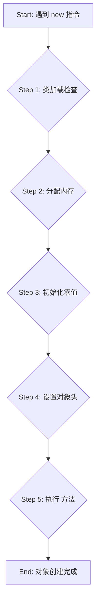

# 深入理解Java虚拟机：对象的创建、内存布局与访问定位

通过 [第一部分：Java内存区域](1.java内存区域.md) 的学习，我们对JVM的内存划分有了宏观的认识。现在，我们将深入到Java堆这片最核心的区域，探索一个普通Java对象从诞生到被使用的完整生命周期：它是如何被创建、在内存中如何存放，以及程序是如何访问它的。

---

## 一、 目录

- [一、 目录](#一-目录)
- [零、 前置知识：深入理解类加载的时机与解析过程](#零-前置知识深入理解类加载的时机与解析过程)
  - [0.1 为何需要前置知识](#01-为何需要前置知识)
  - [0.2 核心概念：符号引用 vs 直接引用](#02-核心概念符号引用-vs-直接引用)
  - [0.3 实例追踪：从 `new UserService()` 开始](#03-实例追踪从-new-userservice-开始)
  - [0.4 总结：类生命周期 vs 对象生命周期](#04-总结类生命周期-vs-对象生命周期)
  - [0.5 特例：字符串字面量与普通对象引用的加载差异](#05-特例字符串字面量与普通对象引用的加载差异)
- [二、 对象的创建过程](#二-对象的创建过程)
  - [2.1 流程概览](#21-流程概览)
  - [2.2 Step 1: 类加载检查](#22-step-1-类加载检查)
  - [2.3 Step 2: 分配内存](#23-step-2-分配内存)
    - [2.3.1 内存分配方式](#231-内存分配方式)
    - [2.3.2 内存分配的并发安全问题](#232-内存分配的并发安全问题)
  - [2.4 Step 3: 初始化零值](#24-step-3-初始化零值)
  - [2.5 Step 4: 设置对象头](#25-step-4-设置对象头)
  - [2.6 Step 5: 执行 `<init>` 方法](#26-step-5-执行-init-方法)
- [三、 对象的内存布局](#三-对象的内存布局)
  - [3.1 整体结构](#31-整体结构)
  - [3.2 对象头 (Header)](#32-对象头-header)
    - [3.2.1 标记字段 (Mark Word)](#321-标记字段-mark-word)
    - [3.2.2 类型指针 (Klass Pointer)](#322-类型指针-klass-pointer)
  - [3.3 实例数据 (Instance Data)](#33-实例数据-instance-data)
  - [3.4 对齐填充 (Padding)](#34-对齐填充-padding)
- [四、 对象的访问定位](#四-对象的访问定位)
  - [4.1 句柄访问 (Handle Access)](#41-句柄访问-handle-access)
  - [4.2 直接指针访问 (Direct Pointer Access)](#42-直接指针访问-direct-pointer-access)
  - [4.3 总结对比](#43-总结对比)

---

## 零、 前置知识：深入理解类加载的时机与解析过程

在深入“对象的创建过程”的五个步骤之前，我们必须先理解一个至关重要但又常常被忽略的前提：**JVM 是如何找到并准备好一个类的“蓝图”（即加载到方法区的类元数据）的？** 只有当一个类的“蓝图”完全就绪后，JVM 才能依据它来创建对象。这个准备“蓝图”的过程，就是类加载，尤其是其“懒加载”和“动态解析”的特性，直接影响着 `new` 指令的行为。

### 0.1 为何需要前置知识

`new` 一个对象的第一步是“类加载检查”，检查一个类是否已经被加载、解析和初始化。这暗示了类加载并不是在JVM启动时一次性完成的，而是一个按需、动态的过程。理解这个过程，特别是符号引用到直接引用的转换，是解开对象创建之谜的钥匙。

### 0.2 核心概念：符号引用 vs 直接引用

这是理解“解析”过程的核心。

-   **符号引用 (Symbolic Reference)**
    -   **是什么**：它是一个**描述性的文本**，一个“代号”。在 `.class` 文件被编译时，JVM并不知道各个类、方法、字段在内存中的具体地址。因此，它使用一个具有唯一性的字符串来标识这些元素。例如，`UserService` 引用 `OrderService`，在 `.class` 文件中记录的就是 `OrderService` 的全限定名，如 `"com/example/OrderService"`。
    -   **比喻**：你写信封，收件人地址写的是 **“北京市朝阳区，张三收”**。这个文本描述就是符号引用。

-   **直接引用 (Direct Reference)**
    -   **是什么**：在此处特指**一个指向方法区中类元数据的内存地址指针**。当 `OrderService` 类被加载后，它在方法区（Metaspace）里就有了一个“身份地址”，这个地址就是我们所说的、用于替换符号引用的“直接引用”。
    -   **比喻**：邮递员通过地址系统，将“北京市朝阳区，张三”这个文本，解析为了**张三这个人在公安系统户籍档案的唯一编号**。通过这个编号，可以找到关于张三的所有定义信息（年龄、籍贯等），但**不是张三家房子的地址**。

**“链接”阶段的“解析”步骤，本质上就是把类的“文本名字”换成它在方法区里的“档案编号”（内存地址）的过程。**

> **重要区分：此处的“直接引用” vs 对象的“直接引用”**
> 你问到了一个非常关键且容易混淆的点上：类加载解析时用的“直接引用”和我们后面讲“对象访问”时栈上的“直接引用”，**不是同一个东西**，但都遵循“直接指向”的核心思想。
> 
> 1.  **类解析的直接引用**：
>     -   **起点**：`UserService` 在方法区里的运行时常量池。
>     -   **终点**：`OrderService` 在**方法区**里的类元数据（Class Metadata，可以理解为类的“蓝图”）。
>     -   **作用**：连接**两个类的定义**，解决“代码从哪找类”的问题。
> 
> 2.  **对象访问的直接引用**：
>     -   **起点**：Java虚拟机栈上的一个 reference 变量。
>     -   **终点**：一个具体对象在**堆内存**中的实例数据（Instance Data，可以理解为根据“蓝图”盖好的“房子”）。
>     -   **作用**：**操作一个具体的对象**，解决“代码操作哪个对象”的问题。
>
> 简单来说，前者是**蓝图指向蓝图**，后者是**钥匙指向房子**。

### 0.3 实例追踪：从 `new UserService()` 开始

让我们通过一个包含两次 `new OrderService()` 的例子，来完整地追踪JVM的内部动作。

**示例代码:**
```java
public class UserService {
    // 成员变量，引用了 OrderService
    private OrderService orderService1;
    private OrderService orderService2;

    public UserService() {
        // 第一次 new OrderService
        System.out.println("准备创建第一个OrderService实例...");
        this.orderService1 = new OrderService();
        System.out.println("第一个OrderService实例创建完成: " + this.orderService1.hashCode());
        
        // 第二次 new OrderService
        System.out.println("准备创建第二个OrderService实例...");
        this.orderService2 = new OrderService();
        System.out.println("第二个OrderService实例创建完成: " + this.orderService2.hashCode());
    }
}

public class OrderService {
    // 静态代码块，用于追踪类初始化过程
    static {
        System.out.println("OrderService 类正在被初始化... (<clinit>)");
    }
    // 构造函数，用于追踪对象实例化过程
    public OrderService() {
        System.out.println("OrderService 实例正在被创建... (<init>)");
    }
}

// 主程序入口
public class Main {
    public static void main(String[] args) {
        new UserService();
    }
}
```

**运行 `Main` 类后的详细步骤分解:**

1.  **加载 `Main` 类**：JVM启动，加载、链接并初始化 `Main` 类，然后执行其 `main` 方法。
2.  **遇到 `new UserService()`**：这是对 `UserService` 的首次主动使用，触发其类加载过程。
    -   **加载**：找到 `UserService.class`，读取其字节码，在方法区创建其运行时数据结构。此时，其运行时常量池中包含了对 `OrderService` 的**符号引用**（如 `"com/example/OrderService"`）。
    -   **链接**：验证、准备、解析 `UserService` 类。注意，此时对 `OrderService` 的符号引用**可能还不会被解析**，因为JVM是懒惰的。
    -   **初始化**：执行 `UserService` 的 `<clinit>` 方法（本例中为空）。
3.  **执行 `UserService` 构造函数 `<init>`**：类准备就绪后，开始在堆上创建 `UserService` 实例。
4.  **遇到第一个 `new OrderService()`**：
    -   **类加载检查**：JVM检查 `OrderService` 是否已初始化。发现没有。
    -   **触发 `OrderService` 的类加载**：
        -   **加载** `OrderService.class`。
        -   **链接** `OrderService.class`。
        -   **初始化 `OrderService`**：JVM发现 `OrderService` 有一个静态代码块，于是执行其 `<clinit>` 方法。**控制台打印：“OrderService 类正在被初始化... (<clinit>)”**。
    -   **解析与替换**：`OrderService` 初始化完成后，它在方法区就有了一个确切的元数据地址。JVM会用这个**直接引用**（元数据地址指针）**替换掉 `UserService` 运行时常量池中对 `OrderService` 的符号引用**。这个替换动作是一次性的。
    -   **创建实例**：现在 `OrderService` 类已就绪，JVM在堆上为其分配内存，并调用其构造函数 `<init>`。**控制台打印：“OrderService 实例正在被创建... (<init>)”**。
    -   第一个 `OrderService` 实例创建完毕。
5.  **遇到第二个 `new OrderService()`**：
    -   **类加载检查**：JVM再次检查 `OrderService` 是否已初始化。**发现它已经被初始化过了**。
    -   **跳过整个类加载过程**：因为类的“蓝图”已经存在，**加载、链接、初始化 (`<clinit>`) 步骤被完全跳过**。不会再打印“OrderService 类正在被初始化...”。
    -   **直接创建实例**：JVM直接使用已加载的 `OrderService` 类信息，在堆上分配一块**新的**内存，并再次调用其构造函数 `<init>`。**控制台打印：“OrderService 实例正在被创建... (<init>)”**。
    -   第二个 `OrderService` 实例创建完毕。

**预期控制台输出:**
```
准备创建第一个OrderService实例...
OrderService 类正在被初始化... (<clinit>)
OrderService 实例正在被创建... (<init>)
第一个OrderService实例创建完成: ...
准备创建第二个OrderService实例...
OrderService 实例正在被创建... (<init>)
第二个OrderService实例创建完成: ...
```
这个输出清晰地证明了：**类初始化 (`<clinit>`) 只发生一次，而对象实例化 (`<init>`) 可以发生多次**。

### 0.4 总结：类生命周期 vs 对象生命周期

| 特性 | 类加载与初始化 (Class Loading & `<clinit>`) | 对象实例化 (Object Instantiation & `<init>`) |
| :--- | :--- | :--- |
| **发生时机** | 首次主动使用一个类时 | 每次调用 `new` 时 |
| **执行次数** | **仅一次** (在单个类加载器环境中) | **可多次** (每次 `new` 都执行) |
| **核心工作** | 准备类的“蓝图”（静态内容）到方法区 | 根据“蓝图”在堆上建造一个“房子”（实例内容） |
| **工作区域** | **方法区 (Metaspace)** | **堆 (Heap)** |

理解了这个区别，我们就能更好地继续探索接下来对象的创建、内存布局等细节。

### 0.5 特例：字符串字面量与普通对象引用的加载差异

通过对字符串 `intern()` 方法的讨论，我们揭示了JVM中一个非常重要的特例。`new String("aaa")` 和 `new OrderService()` 背后的类加载机制存在本质不同。你刚才的总结非常到位：**当一个类加载完成时，它对其他普通类的引用此时还是符号引用，而它对字符串字面量的引用此时已经解析为指向堆中实例的直接引用了。**

我们可以将这两种机制总结为“懒加载”与“急加载”的对比：

1.  **普通对象引用 (如 `OrderService`)：懒加载 (Lazy Loading)**
    -   **处理时机**：当代码**首次主动使用**（例如 `new OrderService()` 或调用其静态方法）时，才会触发对 `OrderService` 类的加载、链接和初始化。
    -   **解析过程**：在首次使用时，JVM才会将运行时常量池中 `OrderService` 的**符号引用**解析为指向其**方法区**中类元数据的**直接引用**。

2.  **字符串字面量 (如 `"aaa"`)：急加载 (Eager Loading)**
    -   **处理时机**：在包含 `"aaa"` 字面量的那个类（比如 `UserService`）被**加载和链接**时，JVM 就已经**主动**处理了这个字面量。
    -   **解析过程**：在链接的解析阶段，JVM会去**字符串常量池(SCP)** 查找或创建 `"aaa"` 的实例，然后**立即**将 `UserService` 的运行时常量池中关于 `"aaa"` 的条目，更新为指向**堆中SCP**里那个实例的**直接引用**。

**核心差异总结**

| 特性 | 普通对象引用 (如 `OrderService`) | 字符串字面量 (如 `"aaa"`) |
| :--- | :--- | :--- |
| **加载策略** | **懒加载 (Lazy)** | **急加载 (Eager)** |
| **解析时机** | 代码**首次主动使用**时 | **类加载的链接(解析)阶段** |
| **RCP初始状态**| 符号引用 (文本描述) | 字面量信息 ("配方") |
| **RCP最终状态**| 指向**方法区**类元数据的直接引用 | 指向**堆**中字符串常量池实例的直接引用 |
| **`new`操作** | `new OrderService()` 首次执行时，会触发**类加载**全过程 | `new String("aaa")` 执行时，`"aaa"` 已在常量池，直接作为参数，在堆上创建**新**对象 |

这个特例清晰地表明，JVM为了效率和内存复用，对不同的常量类型采取了截然不同的处理策略。

---

## 二、 对象的创建过程

Java对象的创建过程，从虚拟机的视角来看，是一个严谨而精密的流程。熟练掌握每一步的细节，对于理解JVM的运行机制至关重要。

### 2.1 流程概览



### 2.2 Step 1: 类加载检查

当虚拟机遇到一条`new`指令时，它首先会执行**类加载检查**：
1.  **检查符号引用**：去当前类的运行时常量池中查找，看是否能定位到`new`指令参数所指定的那个类的符号引用。
2.  **检查类是否已加载**：检查这个符号引用所代表的类是否已经被加载、解析和初始化过。

如果检查结果为否，虚拟机必须立即执行完整的**类加载过程**（加载 -> 验证 -> 准备 -> 解析 -> 初始化），确保类信息被加载到方法区后，才能继续对象的创建。

### 2.3 Step 2: 分配内存

类加载检查通过后，虚拟机将在Java堆中为这个新生对象分配内存。对象所需内存的大小在类加载完成后便已完全确定。

#### 2.3.1 内存分配方式

从堆中划分出一块确定大小的内存，主要有两种方式，具体选择哪种由所采用的垃圾收集器是否带有**空间压缩整理**功能决定。

1.  **指针碰撞 (Bump the Pointer)**
    -   **适用场合**：堆内存**绝对规整**（已用和未用的内存泾渭分明）。
    -   **原理**：所有已用内存放在一边，未用内存放在另一边，中间有一个指针作为分界点。分配内存时，只需将这个指针向未用内存方向移动对象大小的距离即可。
    -   **图示**：
        ```text
        +------------------+-------------------+
        |   已分配内存     |    未分配内存     |
        +------------------+-------------------+
                           ^
                           |
                         分界指针
        
        -- 分配一个新对象后 -->
        
        +----------------------+-------------+
        |   已分配内存 + 新对象 | 未分配内存   |
        +----------------------+-------------+
                               ^
                               |
                             新分界指针
        ```
    -   **使用的GC收集器**：Serial, ParNew, G1等带有压缩整理阶段的收集器。

2.  **空闲列表 (Free List)**
    -   **适用场合**：堆内存**不规整**（已用和未用的内存交错存在）。
    -   **原理**：虚拟机会维护一个列表，记录着哪些内存块是可用的。分配时，从列表中找到一块足够大的空间划分给新对象，并更新列表记录。
    -   **图示**：
        ```text
        堆内存: [已用] [空闲块1] [已用] [空闲块2] [已用]
        
        空闲列表:
        +-----------+-----------+
        |  指针1    |  大小1    | -> 指向 [空闲块1]
        +-----------+-----------+
        |  指针2    |  大小2    | -> 指向 [空闲块2]
        +-----------+-----------+
        
        -- 在[空闲块2]中分配一个新对象后 -->
        
        堆内存: [已用] [空闲块1] [已用] [新对象] [剩余空闲] [已用]
        
        空闲列表: (指针2和大小2被更新)
        +-----------+-----------+
        |  指针1    |  大小1    |
        +-----------+-----------+
        |  新指针2  |  新大小2  |
        +-----------+-----------+
        ```
    -   **使用的GC收集器**：CMS这种基于标记-清除算法的收集器。

#### 2.3.2 内存分配的并发安全问题

对象的创建是一个非常频繁的操作，因此在多线程环境下，必须保证内存分配的线程安全性。虚拟机通常采用以下两种方案来解决这个问题：

1.  **CAS + 失败重试**
    -   **机制**：这是一种乐观锁思想的实现。虚拟机在更新内存分配指针时，采用CAS（比较并交换）操作。
    -   **流程**：线程在尝试分配内存前，先读取当前的指针位置（旧值）。在准备写入新指针位置时，再次检查当前指针位置是否还是那个旧值。如果是，说明没有其他线程修改过，就更新它；如果不是，说明在此期间有其他线程分配了内存，本次尝试失败，线程会进行自旋重试，直到成功为止。
    -   **优点**：保证了指针更新操作的原子性。
    -   **缺点**：在竞争激烈的情况下，自旋重试会消耗CPU资源。

2.  **TLAB (Thread Local Allocation Buffer)**
    -   **机制**：这是一种空间换时间的策略。虚拟机在启动时，会为**每个线程**在新生代的Eden区预先分配一小块私有内存，称为“本地线程分配缓冲”。
    -   **流程**：
        1.  当一个线程需要创建对象时，它会**首先**尝试在自己的TLAB中进行分配。
        2.  因为TLAB是线程私有的，所以在这个区域内分配内存**不需要任何同步机制**，速度极快。
        3.  只有当TLAB用完，或者要分配的对象太大TLAB放不下时，才会启用上述的**CAS机制**在共享的Eden区进行分配，并尝试获取一个新的TLAB。
    -   **参数**：可以通过 `-XX:+/-UseTLAB` 参数来控制是否启用TLAB。

### 2.4 Step 3: 初始化零值

内存分配完成后，虚拟机会将分配到的内存空间（**不包括对象头**）都初始化为零值（例如，`int`为0, `boolean`为`false`, 引用类型为`null`）。

这一步操作保证了对象的实例字段在Java代码中可以不赋初始值就直接使用，程序访问到的是对应数据类型的零值。

### 2.5 Step 4: 设置对象头

初始化零值之后，虚拟机需要对**对象头（Header）**进行一系列必要的设置。一个新创建的对象，其对象头主要包含两部分信息：

1.  **类型指针 (Klass Pointer)**：设置该指针，使其指向方法区中这个对象所属的类元数据。通过这个指针，JVM就能知道这个对象是哪个类的实例。

2.  **标记字段 (Mark Word)**：设置Mark Word的初始状态。对于一个刚刚创建、还没有被任何人使用的对象，其Mark Word（在64位JVM中为8字节）会被设置为**无锁状态**，其内部结构大致如下：
    -   **锁状态标志**: 设为 `001` (后3位)，这代表了一个**无锁**且**非偏向**的对象。
    -   **GC分代年龄**: 设为 `0` (4个比特位)。
    -   **哈希码 (identity_hashcode)**: 此时为空，并未计算。只有在首次调用`hashCode()`方法时，才会计算并存入这块区域。

这些信息共同构成了对象的运行时核心数据，为后续的对象访问、GC以及加锁操作做好了基础准备。

### 2.6 Step 5: 执行 `<init>` 方法（构造函数）

从虚拟机的视角来看，经过以上四步，一个新对象已经诞生了。但是从Java程序的视角来看，对象的创建才刚刚开始——构造函数 `<init>` 方法还没有执行，所有字段都还是零值。

`new`指令之后，会紧接着执行`<init>`方法，按照程序员的意愿对对象进行初始化。只有当`<init>`方法执行完毕后，一个真正**可用的对象**才算完全创建出来。

---

## 三、 对象的内存布局

在HotSpot虚拟机中，一个Java对象在堆内存中的布局可以清晰地划分为三个部分：**对象头 (Header)**、**实例数据 (Instance Data)** 和 **对齐填充 (Padding)**。

### 3.1 整体结构

```text
+----------------------+----------------------+----------------------+
|     对象头 (Header)    |   实例数据 (Instance Data) |  对齐填充 (Padding)   |
+----------------------+----------------------+----------------------+
| [Mark Word | Klass Ptr] |  [定义的各种字段内容]   | [可选, 用于8字节对齐] |
+----------------------+----------------------+----------------------+
```

### 3.2 对象头 (Header)

对象头是内存布局的核心，它包含两部分信息。

#### 3.2.1 标记字段 (Mark Word)

Mark Word用于存储对象自身的运行时数据，它是一个非固定的、高度复用的数据结构，会根据对象的状态（锁状态、GC标记等）存储不同的信息。在64位虚拟机中，它占用8个字节（64 bit）。

**Mark Word 在不同状态下的结构 (64位虚拟机):**

| 状态 | 锁标志位 | 存储内容 (从高位到低位) |
| :--- | :--- | :--- |
| **无锁** | 01 | `unused(25)` `identity_hashcode(31)` `unused(1)` `age(4)` `biased_lock(1)` `lock(2)` |
| **偏向锁** | 01 | `thread_id(54)` `epoch(2)` `unused(1)` `age(4)` `biased_lock(1)` `lock(2)` |
| **轻量级锁** | 00 | `ptr_to_lock_record(62)` `lock(2)` |
| **重量级锁** | 10 | `ptr_to_heavyweight_monitor(62)` `lock(2)` |
| **GC标记** | 11 | `(空, 无标记)` |

-   **identity_hashcode**: 对象的唯一身份哈希码。
-   **age**: 对象在分代GC中的年龄。
-   **biased_lock**: 偏向锁标记位。
-   **lock**: 锁状态标记位，用于区分不同锁。
-   **thread_id**: 持有偏向锁的线程ID。
-   **ptr_to_...**: 指向锁记录或监视器（Monitor）的指针。

#### 3.2.2 类型指针 (Klass Pointer)

类型指针是对象指向其**类元数据**的指针。虚拟机通过这个指针来确定该对象是哪个类的实例。

在64位系统中，如果开启了指针压缩（`-XX:+UseCompressedOops`，默认开启），类型指针会占用4个字节；否则占用8个字节。

### 3.3 实例数据 (Instance Data)

实例数据部分是对象真正存储的有效信息，即程序代码中定义的各种类型的字段内容，无论是从父类继承下来的，还是在子类中定义的，都需要记录起来。

### 3.4 对齐填充 (Padding)

对齐填充并不是必然存在的，它仅仅起着占位符的作用。因为HotSpot虚拟机的自动内存管理系统要求**对象的起始地址必须是8字节的整数倍**。换句话说，对象的大小也必须是8字节的整数倍。

对象头部分正好是8字节的倍数（1倍或2倍），因此，当实例数据部分大小不合适时，就需要通过对齐填充来补全，确保整个对象的大小是8字节的倍数。

---

## 四、 对象的访问定位

创建对象的目的是为了使用它。在Java程序中，我们通过栈上的`reference`类型数据来操作堆上的具体对象。对象的访问方式由虚拟机实现决定，目前主流的访问方式有两种。

### 4.1 句柄访问 (Handle Access)

如果使用句柄访问，Java堆中会划分出一块内存作为**句柄池**。
-   栈上的`reference`存储的是对象的**句柄地址**。
-   句柄中包含了**对象实例数据**和**对象类型数据**各自的具体地址信息。

```text
            [ Java 栈 ]                               [ Java 堆 ]
+----------------------------+      +-------------------------------------------------------+
|                            |      |     [ 句柄池 ]                     [ 对象实例 ]       |
|  +---------------------+   |      | +-------------------+             +-----------------+ |
|  | reference (句柄地址) |-----+-->| | 实例数据指针   |------------->|  实例数据...  | |
|  +---------------------+   |      | +-------------------+             +-----------------+ |
|                            |      | | 类型数据指针   |--+                                |
+----------------------------+      | +-------------------+  |                                |
                                    |                      |     [ 方法区 ]           |
                                    |                      |   +-----------------+ |
                                    +----------------------|---|  类元数据...    | |
                                                           +-> +-----------------+ |
                                                              +-------------------------------------------------------+
```

-   **优点**：`reference`中存储的是稳定的句柄地址。当对象因为GC等原因被移动时，只需改变句柄池中实例数据指针的指向，而栈上的`reference`本身无需修改。
-   **缺点**：访问对象时需要经过两次指针定位，一次到句柄，一次到实例，速度相对较慢。

### 4.2 直接指针访问 (Direct Pointer Access)

如果使用直接指针访问，`reference`中存储的就是**对象的地址**。
-   **HotSpot虚拟机主要采用这种方式。**

```text
            [ Java 栈 ]                               [ Java 堆 ]
+----------------------------+      +-------------------------------------------------------+
|                            |      |                      [ 对象实例 ]                     |
|  +---------------------+   |      |    +----------------------------------------------+   |
|  | reference (对象地址) |-----+--->| [对象头] [实例数据] ...                        |   |
|  +---------------------+   |      |    |                                              |   |
|                            |      |    +------------------+---------------------------+   |
+----------------------------+      |                       |                               |
                                    |                       |      [ 方法区 ]             |
                                    |                       |    +-----------------+    |
                                    | (类型指针) -----------+--> |  类元数据...    |    |
                                    |                            +-----------------+    |
                                    +-------------------------------------------------------+
```

-   **优点**：访问速度快，节省了一次指针定位的时间开销。
-   **缺点**：当对象因为GC等原因被移动时，需要修改栈上`reference`的值。

### 4.3 总结对比

| 特性 | 句柄访问 | 直接指针访问 |
| :--- | :--- | :--- |
| **访问效率** | 较低（两次指针解引用） | **较高**（一次指针解引用） |
| **GC对象移动**| `reference`稳定，只需修改句柄 | **需要修改`reference`** |
| **实现** | 复杂，需要维护句柄池 | 简单 |
| **主流选择**| (较少使用) | **HotSpot采用** |
