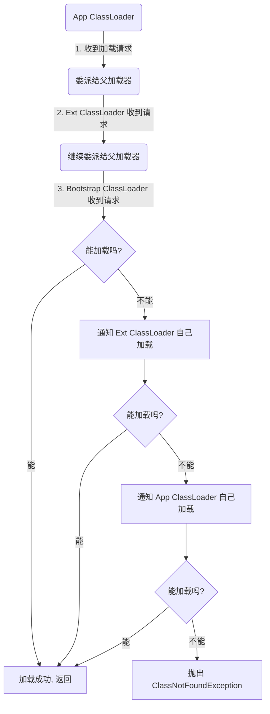

# 深入理解Java虚拟机：类加载器与双亲委派模型

在 [上一章：类加载过程详解](4.类加载过程详解.md) 中，我们了解到类加载的第一个阶段“加载”，是通过一个类的全限定名来获取其二进制字节流。而完成这个关键动作的组件，就是本章的主角——**类加载器 (Class Loader)**。

本章将深入探讨Java中的类加载器体系，以及其背后精妙的设计哲学——**双亲委派模型**。

---

## 一、 目录

- [一、 目录](#一-目录)
- [二、 什么是类加载器？](#二-什么是类加载器)
  - [2.1 核心作用](#21-核心作用)
  - [2.2 类的唯一性原则](#22-类的唯一性原则)
- [三、 Java中的类加载器](#三-java中的类加载器)
  - [3.1 启动类加载器 (Bootstrap Class Loader)](#31-启动类加载器-bootstrap-class-loader)
  - [3.2 扩展类加载器 (Extension Class Loader)](#32-扩展类加载器-extension-class-loader)
  - [3.3 应用程序类加载器 (Application Class Loader)](#33-应用程序类加载器-application-class-loader)
  - [3.4 层次关系](#34-层次关系)
- [四、 双亲委派模型 (Parents Delegation Model)](#四-双亲委派模型-parents-delegation-model)
  - [4.1 什么是双亲委派模型？](#41-什么是双亲委派模型)
  - [4.2 工作流程](#42-工作流程)
  - [4.3 源码解析](#43-源码解析)
  - [4.4 模型优势](#44-模型优势)
- [五、 打破双亲委派模型](#五-打破双亲委派模型)
  - [5.1 为何要打破？](#51-为何要打破)
  - [5.2 核心矛盾：SPI机制](#52-核心矛盾spi机制)
  - [5.3 解决方案：线程上下文类加载器](#53-解决方案线程上下文类加载器)
  - [5.4 应用案例：Tomcat](#54-应用案例tomcat)
- [六、 自定义类加载器](#六-自定义类加载器)

---

## 二、 什么是类加载器？

### 2.1 核心作用

**类加载器 (Class Loader)** 是一个负责加载类的对象。它的核心职责，就是根据一个类的全限定名（二进制名称），定位或生成对应的`.class`文件的二进制字节流，然后将这些字节流加载到JVM中，最终在内存里创建一个`java.lang.Class`对象。

简单来说，类加载器的主要作用就是**实现类加载过程中的“加载”阶段**。

除了加载`.class`文件，类加载器也能加载应用所需的其他资源，如图片、配置文件等，但其最核心、最基础的功能是动态加载Java类。

### 2.2 类的唯一性原则

在JVM中，要判断两个类是否“相等”，并不仅仅是看它们的**全限定名**是否一致，还必须看加载这两个类的**类加载器**是否是同一个。

> **JVM判定两个类相同的充要条件是：类的全限定名相同，并且加载该类的ClassLoader实例也相同。**

这意味着，即使两个类来源于同一个`.class`文件，被同一个虚拟机加载，只要加载它们的类加载器不同，那这两个类就必定不相等。这个原则是理解Java类隔离机制（如Tomcat）的基础。

---

## 三、 Java中的类加载器

JVM中内置了三个重要的类加载器，它们共同构成了Java应用的基础类加载环境。

### 3.1 启动类加载器 (Bootstrap Class Loader)

-   **实现**：由C++语言实现，是JVM自身的一部分。
-   **职责**：负责加载Java最核心的类库，即`<JAVA_HOME>\lib`目录下的，或者被`-Xbootclasspath`参数所指定的路径中存放的，而且是JVM能识别的（按文件名识别，如`rt.jar`）类库。
-   **特点**：它是所有类加载器的“顶层”，在Java代码中无法直接获取到它的引用，尝试获取它的返回值是`null`。它没有父加载器。

### 3.2 扩展类加载器 (Extension Class Loader)

-   **实现**：由Java语言实现（`sun.misc.Launcher$ExtClassLoader`）。
-   **职责**：负责加载`<JAVA_HOME>\lib\ext`目录下的，或者被`java.ext.dirs`系统变量所指定的路径中的所有类库。
-   **特点**：开发者可以直接使用扩展类加载器。在Java 9之后，这个加载器被**平台类加载器 (Platform Class Loader)** 所取代，职责也相应调整。

### 3.3 应用程序类加载器 (Application Class Loader)

-   **实现**：由Java语言实现（`sun.misc.Launcher$AppClassLoader`）。
-   **职责**：也称为**系统类加载器 (System Class Loader)**，它负责加载用户类路径（Classpath）上所指定的类库。
-   **特点**：是程序中默认的类加载器。我们自己编写的Java类，通常都是由它来加载的。

### 3.4 层次关系

这三个类加载器之间存在一种**父子**的层次关系，这种关系通常通过**组合 (Composition)** 模式来实现，而不是继承。这种层次关系是双亲委派模型的基础。

```mermaid
graph TD
    A[Bootstrap Class Loader (null)] --> B[Extension Class Loader];
    B --> C[Application Class Loader];
    C --> D[Custom Class Loader];

    style A fill:#f9f,stroke:#333,stroke-width:2px
    style B fill:#bbf,stroke:#333,stroke-width:2px
    style C fill:#9f9,stroke:#333,stroke-width:2px
    style D fill:#f99,stroke:#333,stroke-width:2px
```

**代码验证：**
```java
public class ClassLoaderHierarchy {
    public static void main(String[] args) {
        ClassLoader loader = ClassLoaderHierarchy.class.getClassLoader();
        while (loader != null) {
            System.out.println(loader.toString());
            loader = loader.getParent();
        }
        // 当 loader 为 null 时，表示其父加载器是 Bootstrap Class Loader
        System.out.println("The parent of the last loader is Bootstrap Class Loader (represented as null)");
    }
}
```
**输出:**
```
sun.misc.Launcher$AppClassLoader@18b4aac2
sun.misc.Launcher$ExtClassLoader@1540e19d
The parent of the last loader is Bootstrap Class Loader (represented as null)
```

---

## 四、 双亲委派模型 (Parents Delegation Model)

### 4.1 什么是双亲委派模型？

双亲委派模型是Java官方推荐的类加载器工作机制。它并不是一个强制性的约束，而是Java设计者推荐的一种类加载实现方式。

**核心思想**：当一个类加载器收到类加载请求时，它首先不会自己去尝试加载这个类，而是把这个请求**委派给它的父类加载器**去完成。每一层的类加载器都是如此，因此所有的加载请求最终都应该传送到最顶层的启动类加载器中。只有当父加载器反馈自己无法完成这个加载请求（在它的搜索范围内没有找到所需的类）时，子加载器才会尝试自己去加载。

> **澄清“双亲”**：这里的“双亲”容易引起误解，它并非指父母两个，而是指“Parent”这个单数。翻译成“父级委派模型”或“家长委派模型”可能更准确。

### 4.2 工作流程



### 4.3 源码解析

双亲委派模型的实现逻辑，都封装在`java.lang.ClassLoader`的`loadClass()`方法中。

```java
// Simplified JDK 8 source code
protected Class<?> loadClass(String name, boolean resolve) throws ClassNotFoundException {
    synchronized (getClassLoadingLock(name)) {
        // 1. 检查这个类是否已经被加载过
        Class<?> c = findLoadedClass(name);

        if (c == null) {
            long t0 = System.nanoTime();
            try {
                // 2. 如果有父加载器，就委派给父加载器
                if (parent != null) {
                    c = parent.loadClass(name, false);
                } else {
                    // 3. 如果父加载器是 null, 表示已经到了顶层，
                    //    委派给 Bootstrap Class Loader 加载
                    c = findBootstrapClassOrNull(name);
                }
            } catch (ClassNotFoundException e) {
                // 父加载器抛出异常，说明加载失败
            }

            if (c == null) {
                // 4. 如果父加载器无法加载，
                //    则调用自己的 findClass() 方法进行加载
                long t1 = System.nanoTime();
                c = findClass(name);

                // ... performance statistics ...
            }
        }
        if (resolve) {
            resolveClass(c);
        }
        return c;
    }
}
```
`findClass(String name)`方法默认是空实现，需要自定义类加载器时，推荐重写此方法，而不是`loadClass()`方法。

### 4.4 模型优势

1.  **避免类的重复加载**：通过委派，一个类最终只会被一个确定的类加载器加载。这保证了在程序中，对于同一个全限定名的类，其`Class`对象是唯一的。
2.  **保证核心API安全**：该模型确保了Java核心库的类（如`java.lang.Object`）始终由启动类加载器加载，而不会被用户自定义的、可能怀有恶意的同名类所替代。任何尝试加载`java.lang.Object`的请求，最终都会被委派到启动类加载器，从而保证了核心API的纯洁性和安全性。

---

## 五、 打破双亲委派模型

### 5.1 为何要打破？

双亲委派模型完美地解决了“自上而下”的加载问题，但它无法解决“自下而上”的依赖需求。即：**父加载器需要加载一个类，但这个类依赖于只有子加载器才能加载的类**。

### 5.2 核心矛盾：SPI机制

**SPI (Service Provider Interface)** 机制是打破双亲委派模型的典型场景。

-   **Java官方定义接口**：Java在核心库（`rt.jar`）中定义了许多服务接口，例如JDBC规范中的`java.sql.Driver`接口。这个接口由**启动类加载器**加载。
-   **第三方厂商实现接口**：数据库厂商（如MySQL）会提供`java.sql.Driver`接口的具体实现类，例如`com.mysql.jdbc.Driver`。这个实现类通常放在应用程序的Classpath下，由**应用程序类加载器**加载。

**问题来了**：当Java的`DriverManager`（由启动类加载器加载）需要加载并实例化具体的`Driver`实现类时，它无法做到。因为启动类加载器无法“向下”看到应用程序类加载器路径下的类，更无法委派任务给它。

### 5.3 解决方案：线程上下文类加载器

为了解决这个矛盾，Java引入了**线程上下文类加载器 (Thread Context Class Loader)**。

-   **机制**：它允许在线程级别设置一个特定的类加载器。父类加载器在需要时，可以获取当前线程的上下文类加载器，并使用它来加载所需的类，从而“逆向”调用了子类加载器。
-   **在SPI中的应用**：当`DriverManager`需要加载`Driver`实现时，它会从当前线程获取上下文类加载器（通常是应用程序类加载器），然后用这个加载器去加载第三方厂商的`Driver`实现类，从而打破了双批委派的限制。

```java
// JNDI, JDBC, JCE, JAXB等SPI机制都广泛使用此模式
ClassLoader contextClassLoader = Thread.currentThread().getContextClassLoader();
Class.forName("com.mysql.jdbc.Driver", true, contextClassLoader);
```

### 5.4 应用案例：Tomcat

Tomcat作为Web容器，需要解决多个Web应用之间的类库隔离问题。如果使用默认的类加载器，当两个应用依赖同一个库的不同版本时，就会产生冲突。

因此，Tomcat自定义了一套类加载器体系，为每个Web应用创建一个独立的**WebAppClassLoader**。这个加载器在加载类时，会**优先在自己的Web应用目录（`WEB-INF/lib`和`WEB-INF/classes`）下查找**，找不到时才向上委派。这与标准的双亲委派模型正好相反，也是一种经典的“打破”场景。

---

## 六、 自定义类加载器

除了JVM内置的加载器，用户还可以通过继承`java.lang.ClassLoader`来创建自己的类加载器，以实现特殊的需求，例如：
-   从加密的文件中加载类。
-   从网络动态下载并执行代码。
-   实现应用的热部署。

**实现方式**：
-   **推荐方式（遵循双亲委派）**：继承`ClassLoader`并重写`findClass(String name)`方法。在`findClass`中实现自定义的类加载逻辑（如解密、网络获取等）。`loadClass`方法会先走双亲委派，失败后才会调用到你的`findClass`。
-   **特殊方式（打破双亲委派）**：继承`ClassLoader`并重写`loadClass(String name, boolean resolve)`方法。这让你完全掌控加载流程，可以实现类似Tomcat的“反向”加载逻辑。
