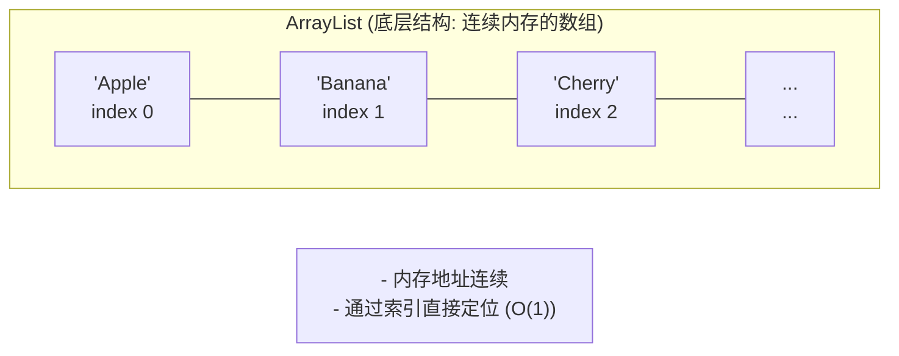
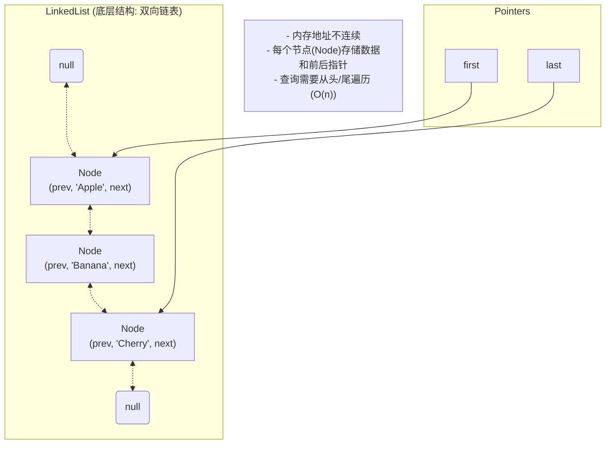

# 深入理解 Java List：ArrayList vs. LinkedList

你好！我们正式开始学习 Java 集合框架。`List` 是我们日常开发中使用最频繁的接口之一，而 `ArrayList` 和 `LinkedList` 则是它的两个最重要的实现。

你提供的参考资料很棒，但我们换个方式，从最直观的比喻入手，深入它们的内部，看看它们到底是如何工作的。

### 目录

- [1. 宏观视角：什么是 List？](#1-宏观视角什么是-list)
- [2. 主角登场：ArrayList、LinkedList 和 Vector](#2-主角登场arraylist-linkedlist-和-vector)
- [3. 深入 `ArrayList`：优等生为何偏科？](#3-深入-arraylist优等生为何偏科)
  - [3.1 核心原理：连续的储物柜](#31-核心原理连续的储物柜)
  - [3.2 性能分析：为什么查得快，增删慢？](#32-性能分析为什么查得快增删慢)
  - [3.3 扩容的秘密：源码级详解](#33-扩容的秘密源码级详解)
- [4. 深入 `LinkedList`：灵活的火车](#4-深入-linkedlist灵活的火车)
  - [4.1 核心原理：手拉手的节点](#41-核心原理手拉手的节点)
  - [4.2 性能分析：为什么增删快，查得慢？](#42-性能分析为什么增删快查得慢)
  - [4.3 “扩容”的真相：没有扩容，只有“挂车厢”](#43-扩容的真相没有扩容只有挂车厢)
- [5. 全面对比：什么时候用谁？](#5-全面对比什么时候用谁)
- [6. 简单说说 `Vector`](#6-简单说说-vector)
- [7. 面试核心总结](#7-面试核心总结)

---

### 1. 宏观视角：什么是 List？

`List` 在 Java 中被称为“有序集合”。它的核心特点就两个字：**有序**。

- **有序**：你放进去的元素的顺序和取出来的顺序是一致的。
- **可重复**：你可以放进多个相同的元素。

`List` 就像一个排好队的队伍，每个人（元素）都有自己的位置编号（索引），你可以根据编号快速找到任何人。

---

### 2. 主角登场：ArrayList、LinkedList 和 Vector

虽然它们都遵守 `List` 的规则，但内部的实现方式却天差地别，这导致了它们在不同场景下的性能表现截然不同。

- **`ArrayList` (数组列表)**：我们最常用的实现。它的特点是**查询快，增删慢**。
- **`LinkedList` (链表)**：特点是**增删快，查询慢**。
- **`Vector` (向量)**：一个**线程安全**的 `ArrayList`，非常古老，现在已经很少使用。

今天，我们的重点是 `ArrayList` 和 `LinkedList`。

---

### 3. 深入 `ArrayList`：优等生为何偏科？

`ArrayList` 是我们大部分场景下的首选，就像班级里的优等生。但它也有不擅长的地方。

#### 3.1 核心原理：连续的储物柜

`ArrayList` 的底层就是一个**动态数组**。你可以把它想象成一排**连续编号的储物柜**。

- **`elementData`**: `ArrayList` 内部有一个叫做 `elementData` 的数组（`Object[]` 类型），所有存入的元素都放在这个数组里。
- **`size`**: 一个整数，记录了当前已经使用了多少个储物柜（即列表中的元素数量）。

#### 3.2 性能分析：为什么查得快，增删慢？

理解了储物柜模型，性能特点就一目了然了。

- **查询快 (`get(index)`)**:
  你想找 5 号储物柜里的东西，直接走过去打开就行了。因为数组的内存地址是连续的，通过索引计算偏移量可以瞬间定位到元素，所以时间复杂度是 **O(1)**。

- **增删慢 (`add(index, e)` / `remove(index)`)**:
  这就要分情况了：
  - **在末尾增删**：很快。在最后一个储物柜后面加一个或拿走最后一个，不影响其他人。时间复杂度是 **O(1)**（不考虑扩容）。
  - **在中间增删**：**非常慢**。比如你想在 3 号和 4 号储物柜之间加一个新的。你必须把从 4 号开始的所有东西都拿出来，依次往后挪一个位置，腾出空间给新来的。删除同理。这涉及到大量元素的移动。时间复杂度是 **O(n)**。

#### 3.3 扩容的秘密：源码级详解

`ArrayList` 的数组容量是有限的。当我们不断调用 `add` 方法，储物柜总有占满的一天。此时，`ArrayList` 就会**自动扩容（grow）**。

这是 `ArrayList` 的核心细节，也是面试常考点。结合源码，整个扩容过程像一个精密的流水线：

1.  **入口与检查 (`add` -> `ensureCapacityInternal`)**:
    当你调用 `add(e)` 方法时，它第一步就是调用 `ensureCapacityInternal(size + 1)` 来确保容量足够。`size + 1` 就是本次添加元素后所需的最小容量。

2.  **计算容量 (`calculateCapacity`) - 懒加载的关键**:
    `ensureCapacityInternal` 会接着调用 `calculateCapacity`。这一步体现了 `ArrayList` 的**懒加载（或延迟初始化）**思想：
    -   如果你是通过 `new ArrayList()` 创建的实例，此时底层的 `elementData` 数组是一个**特殊的空数组 `DEFAULTCAPACITY_EMPTY_ELEMENTDATA`**。
    -   `calculateCapacity` 会检查到这个特殊状态，并在添加第一个元素时，返回 `DEFAULT_CAPACITY` (也就是 10) 作为期望的容量。
    -   如果你是通过 `new ArrayList(0)` 创建的，或者已经 `clear()` 过，那 `elementData` 就是普通的 `EMPTY_ELEMENTDATA`，扩容时就会根据实际需要的容量来。

3.  **判断是否扩容 (`ensureExplicitCapacity`)**:
    拿到计算出的容量后，会调用 `ensureExplicitCapacity`。这个方法很简单，就是判断 `minCapacity` 是否大于当前数组的实际长度 `elementData.length`。如果大于，说明“储物柜”真的不够用了，就必须调用 `grow()` 方法。

4.  **执行扩容 (`grow`)**:
    `grow()` 是扩容的核心，执行了以下操作：
    -   **计算新容量**：`int newCapacity = oldCapacity + (oldCapacity >> 1);` 新的容量是**旧容量的 1.5 倍**。这里的 `>> 1` 是位运算右移一位，等同于除以2，效率更高。
    -   **容量修正**：如果 1.5 倍扩容后，新容量仍然小于 `minCapacity`（比如使用 `addAll` 一次性加入大量元素），那么就直接使用 `minCapacity` 作为新容量。
    -   **边界检查**：检查新容量是否超过了数组的最大限制 `MAX_ARRAY_SIZE` (`Integer.MAX_VALUE - 8`)，防止内存溢出。
    -   **数据拷贝**：最后，调用 `Arrays.copyOf(elementData, newCapacity)`，创建一个更大的新数组，并将旧数组中的所有元素**原封不动地拷贝**到新数组中，完成扩容。

**关键点**：扩容是一个非常**耗费性能**的操作，因为它涉及到整个数组的内存申请和数据拷贝。因此，如果在创建 `ArrayList` 时能预估到数据量，最好在初始化时就指定一个合理的容量 `new ArrayList<>(capacity)`，可以有效避免或减少扩容次数。

### 4. 深入 `LinkedList`：灵活的火车

如果说 `ArrayList` 是排得整整齐齐的储物柜，那 `LinkedList` 就是一列**可以随时拆卸和组装的火车**。

#### 4.1 核心原理：手拉手的节点

`LinkedList` 的底层是一个**双向链表**。它不使用连续的内存。

- **`Node` (节点/车厢)**：`LinkedList` 中的每个元素都被包装成一个 `Node` 对象。这个 `Node` 对象除了存放元素本身，还记录了**前一个节点的位置 (`prev`)** 和 **后一个节点的位置 (`next`)**。
- **`first` / `last`**: `LinkedList` 内部只需要两个指针，一个指向头节点 (`first`)，一个指向尾节点 (`last`)。

#### 4.2 性能分析：为什么增删快，查得慢？

理解了火车模型，性能特点也就清楚了。

- **增删快 (`add(index, e)` / `remove(index)`)**:
  - **在头尾增删 (`addFirst`, `addLast`)**：**非常快**。比如在火车头加一节车厢，只需要让新车厢指向原来的火车头，再让 `first` 指针指向新车厢即可。操作仅涉及几个指针的改变。时间复杂度是 **O(1)**。
  - **在中间增删**：**操作本身很快**。比如要在 3 号和 4 号车厢之间加一节。只需要断开 3 和 4 的连接，然后让 3 指向新车厢，新车厢指向 4 即可。这个“连接”的动作是 **O(1)** 的。但是，前提是你得**先找到 3 号车厢**，这个查找过程是慢的，见下一点。

- **查询慢 (`get(index)`)**:
  **非常慢**。你想找第 5 节车厢，你不能直接跳过去。你必须从火车头 (`first`) 开始，一节一节地数：“1, 2, 3, 4, 5”，直到找到它。`LinkedList` 做了一个小优化，它会判断你要找的索引是在前半段还是后半段，然后决定是从头开始数还是从尾开始数，但最坏情况下还是要遍历半个列表。时间复杂度是 **O(n)**。

#### 4.3 “扩容”的真相：没有扩容，只有“挂车厢”

这是 `LinkedList` 和 `ArrayList` 的一个本质区别。

`LinkedList` **根本没有“扩容”这个概念**。它不是一块连续的内存。每当你 `add` 一个新元素，它只是在内存中 new 一个新的 `Node` 对象（一节新车厢），然后把它连接到链表的末尾（或中间）。只要内存足够，它就可以无限地“挂车厢”，不需要像 `ArrayList` 那样进行昂贵的数组拷贝。

---

### 5. 全面对比：什么时候用谁？

| 特性             | `ArrayList`                               | `LinkedList`                                                 |
| :--------------- | :---------------------------------------- | :----------------------------------------------------------- |
| **底层数据结构**   | 动态数组                                  | 双向链表                                                     |
| **随机访问 (`get`)** | **极快 (O(1))**                           | **很慢 (O(n))**                                              |
| **头部插入/删除**  | 很慢 (O(n))                               | **极快 (O(1))**                                              |
| **尾部插入/删除**  | **很快 (O(1))** (不考虑扩容)                | **极快 (O(1))**                                              |
| **中间插入/删除**  | 很慢 (O(n))                               | **操作本身快 (O(1))**，但查找位置慢 (O(n))                     |
| **内存占用**       | 较少 (只需数组本身开销)                   | 较大 (每个元素都需要额外的 `Node` 对象来存前后指针)            |
| **扩容机制**       | 有，1.5倍扩容，开销大                     | **无**                                                       |

**选择指南：**
- **无脑用 `ArrayList`**: 在 99% 的场景下，你都应该优先选择 `ArrayList`。因为随机访问（查询、遍历）的需求远远大于在列表- 中间进行增删的需求。
- **什么时候用 `LinkedList`**:
  1.  当你需要实现一个**队列（Queue/Deque）**时，`LinkedList` 提供了 `addFirst`, `removeLast` 等方法，性能极高。
  2.  当你有**海量的、频繁的**在列表**中间**或**头部**进行插入和删除操作时。注意是“海量且频繁”，否则 `ArrayList` 的性能损失可能并不明显。

---

### 6. 简单说说 `Vector`

- `Vector` 就是一个**元老级**的 `ArrayList`。
- 它的实现和 `ArrayList` 几乎一模一样，但它所有对外的方法（`add`, `get`, `remove`等）都加上了 `synchronized` 关键字。
- **优点**：线程安全。
- **缺点**：性能差。因为 `synchronized` 会锁住整个对象，导致并发效率极低。扩容时默认是 **2 倍**，会造成更大的空间浪费。
- **结论**：**不要使用它**。在需要线程安全的列表时，有更好的选择，如 `CopyOnWriteArrayList` 或使用 `Collections.synchronizedList()`。

---

### 7. 面试核心总结

当面试官问到这三者时，你可以这样回答：

1.  **开门见山**：“`ArrayList`、`LinkedList` 和 `Vector` 都是 `List` 接口的实现，是有序、可重复的集合。它们最核心的区别在于底层数据结构的不同。”
2.  **`ArrayList`**：“`ArrayList` 底层是动态数组，它的优点是**随机访问快（O(1))**，因为内存连续。缺点是在**中间插入和删除慢（O(n))**，因为需要移动大量元素。它的扩容机制是面试的重点，后面可以详细展开。”
3.  **`LinkedList`**：“`LinkedList` 底层是双向链表，每个元素都是一个包含前后指针的 `Node`。它的优点是**在头尾和中间的插入删除操作非常快（O(1))**，只需改变指针。缺点是**随机访问很慢（O(n))**，需要遍历链表。它没有扩容机制，内存占用也比 `ArrayList` 更大。”
4.  **`Vector`**：“`Vector` 是一个线程安全的 `ArrayList`，但由于其 `synchronized` 锁粒度太大导致性能低下，现在基本已经被淘汰了。”
5.  **场景选择**：“因此，在绝大部分需要随机访问和遍历的场景下，我们都应该优先选择 `ArrayList`。只有在需要实现队列，或者有大量数据需要在列表头部或中间频繁增删的特定场景下，才会考虑使用 `LinkedList`。”

#### 面试加分项：详细描述 ArrayList 扩容机制

“面试官您好，关于 `ArrayList` 的扩容机制，我的理解是这样的：

`ArrayList` 的扩容时机是在我们调用 `add` 方法时，它会检查是否需要扩容。它的扩容有几个关键特点：

1.  首先，它是**懒加载**的。如果我们使用 `new ArrayList()` 创建对象，此时它内部只是一个空数组，并不会立即分配容量。只有在**第一次添加元素**时，`ArrayList` 才会真正创建一个初始容量为 10 的数组。

2.  其次，当容量不足时，它会进行**1.5倍扩容**。如果1.5倍扩容后依然小于所需的最小容量（minCapacity，例如 `addAll` 时），则会直接使用 minCapacity 作为新容量。这里还有一个很重要的边界检查：
    -   如果新容量超过了一个巨大的阈值 `Integer.MAX_VALUE - 8`，程序会尝试分配 `Integer.MAX_VALUE` 作为最终容量。
    -   如果所需的最小容量本身就大于 `Integer.MAX_VALUE - 8`，或者 JVM 无法分配这么大的数组，最终就会抛出 `OutOfMemoryError`。

3.  最后，扩容的核心操作是**数组拷贝**。它会通过 `Arrays.copyOf()` 创建一个更大的新数组，然后把旧数组的所有元素都复制到新数组里。这是一个比较耗费性能的操作，所以如果我们能预知存储的元素数量，最好在初始化时就指定一个合理的容量，以减少不必要的扩容。”

#### 面试终极追问：`MAX_ARRAY_SIZE` 的奥秘

**问：为什么 `ArrayList` 的最大容量是 `Integer.MAX_VALUE - 8`，而不是 `Integer.MAX_VALUE`？**

答：“这是出于兼容性和稳定性的考虑。在一些 JVM 的实现中，对象（包括数组）在内存中需要有‘对象头’来存储元数据，比如数组的长度。这个对象头会占用几个字节（例如8个字节）的空间。为了防止在分配理论上最大尺寸的数组时，因为这几个字节的额外开销而导致内存分配失败，JDK 的开发者选择了一个保守的策略，预留了 8 个字节的 buffer，这是一个典型的防御性编程实践。”

**问：源码 `hugeCapacity` 方法里，如果所需的容量 `minCapacity` 超过了 `MAX_ARRAY_SIZE`，为什么是返回 `Integer.MAX_VALUE`，万一还不够怎么办？**

答：“首先，Java 中数组的长度由 `int` 类型决定，所以它的理论上限就是 `Integer.MAX_VALUE`，不存在比这个还大的数组。其次，`hugeCapacity` 方法里的 `if (minCapacity < 0)` 判断非常关键，它实际上是在处理**整数溢出**。当所需的容量大到超过 `Integer.MAX_VALUE` 时，计算结果会溢出变成一个负数，这个 `if` 语句就会捕获到这种情况并直接抛出 `OutOfMemoryError`。所以，当代码执行到 `return Integer.MAX_VALUE;` 时，已经是我们能为数组请求的、在 `int` 范围内的最大容量了。如果此时 JVM 的堆内存不足以分配这么大的空间，`Arrays.copyOf` 在执行时也会抛出 `OutOfMemoryError`。”
