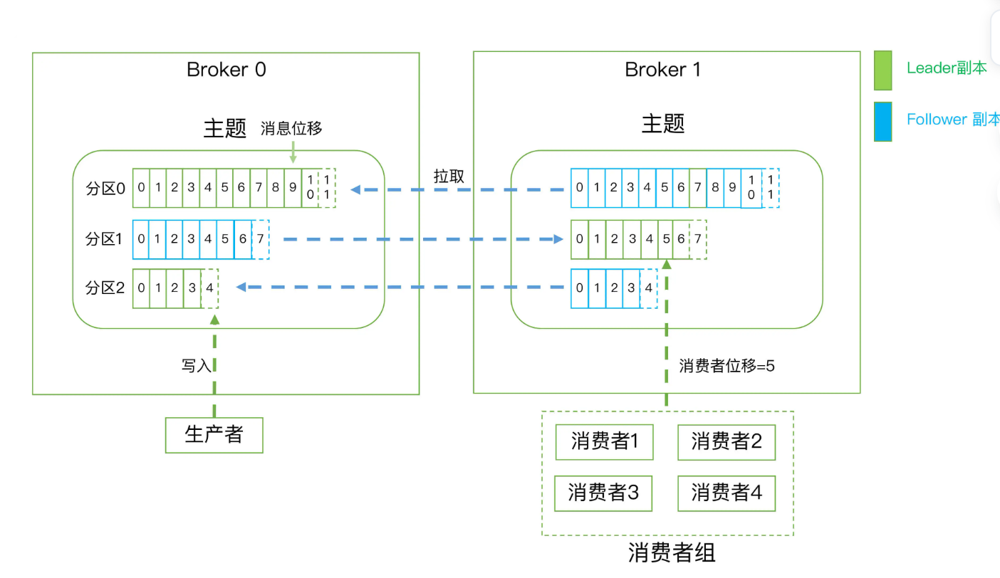

# Kafka 核心概念解析

Kafka 作为一个分布式的消息引擎系统，其核心功能是提供一套高效、可靠的消息发布与订阅解决方案。理解其基本概念是掌握 Kafka 的第一步。本文将以清晰、易懂的方式，带你梳理 Kafka 的核心术语与架构。

<!-- TOC -->

- [1. Kafka 核心组件与角色](#1-kafka-核心组件与角色)
- [2. Kafka 的消息架构：主题、分区与副本](#2-kafka-的消息架构主题分区与副本)
  - [2.1 分区 (Partition) - 实现伸缩性 (Scalability)](#21-分区-partition---实现伸缩性-scalability)
  - [2.2 副本 (Replica) - 保障高可用 (High Availability)](#22-副本-replica---保障高可用-high-availability)
  - [2.3 架构总结：三层关系](#23-架构总结三层关系)
- [3. 消费者与消费者组](#3-消费者与消费者组)
  - [3.1 消费者组 (Consumer Group)](#31-消费者组-consumer-group)
  - [3.2 消费者位移 (Consumer Offset)](#32-消费者位移-consumer-offset)
  - [3.3 重平衡 (Rebalance)](#33-重平衡-rebalance)
- [4. 数据存储机制](#4-数据存储机制)
- [5. 核心概念速查表](#5-核心概念速查表)
- [6. 进阶探讨：为什么 Follower 副本不提供读服务？](#6-进阶探讨为什么-follower-副本不提供读服务)

<!-- /TOC -->

## 1. Kafka 核心组件与角色

想象一个邮政系统，Kafka 的各个组件就像是其中的不同角色。

-   **主题 (Topic)**：如同邮局里不同目的地的信箱分类。在 Kafka 中，主题是消息的逻辑容器，用来对消息进行分类。例如，你可以为“订单数据”、“用户行为日志”等不同业务分别创建主题。

-   **生产者 (Producer)**：如同寄信人。生产者是创建消息并将其发送（发布）到指定主题的客户端应用程序。

-   **消费者 (Consumer)**：如同收信人。消费者是订阅一个或多个主题，并处理所接收到消息的客户端应用程序。

-   **Broker**：如同邮局的分拣中心。Broker 是 Kafka 集群中的一个服务器节点。它负责接收生产者的消息，将其存储在磁盘上，并处理消费者的拉取请求。

-   **集群 (Cluster)**：如同全国的邮政网络。一个 Kafka 集群由多个 Broker 组成。将 Broker 分散部署在不同机器上，可以实现高可用性——即使某台机器宕机，其他 Broker 依然可以继续提供服务。

## 2. Kafka 的消息架构：主题、分区与副本

为了实现高吞吐量和高可用性，Kafka 在主题这个逻辑概念之下，设计了分区和副本两个核心机制。

### 2.1 分区 (Partition) - 实现伸缩性 (Scalability)

如果一个主题的消息量非常大，单个 Broker 的磁盘可能无法容纳，处理能力也会达到瓶颈。这时就需要分区机制。

-   **什么是分区？**：分区是将一个主题分割成多个部分的物理单元。每个主题可以有一个或多个分区。生产者发送的每条消息，最终只会落在一个分区里。例如，一个主题有两个分区（分区0，分区1），一条消息要么被写入分区0，要么被写入分区1。

    > **补充：一个 Broker 能承载多少分区？**
    >
    > 这是一个非常实际且重要的问题。理论上，Kafka 并没有一个硬性的、写在代码里的上限来规定一个 Broker 最多能有多少个分区。但是，在实际应用中，分区数量会受到硬件资源和性能的严重制约。因此，存在一个**事实上的上限**。
    >
    > 把一个分区想象成一个需要 Broker 管理的小单元。管理的单元越多，Broker 的负担就越重。主要瓶颈来自于以下几个方面：
    >
    > 1.  **文件句柄 (File Handles)**：每个分区在 Broker 上都对应着一个目录和多个日志段文件。操作系统对于一个进程（即 Broker 进程）能够打开的文件句柄数量是有限制的。成千上万的分区意味着需要同时打开成千上万的文件，这会迅速耗尽系统的文件句柄资源。
    > 2.  **内存消耗 (Memory Usage)**：Broker 需要为每个分区在内存中维护一些元数据和索引信息。分区越多，消耗的内存就越多，这可能导致频繁的垃圾回收（GC），影响 Broker 性能。
    > 3.  **CPU 开销**：
    >     *   **副本同步**：追随者副本需要不断地从领导者副本拉取数据。分区越多，集群内的同步请求就越多，占用的 CPU 和网络带宽也越多。
    >     *   **故障恢复**：当某个 Broker 宕机时，集群需要为它上面的所有领导者分区进行重新选举。如果一个 Broker 上有数千个分区，这个选举过程会非常耗时，导致集群在一段时间内不可用。
    > 4.  **ZooKeeper 负载**：分区的元数据信息（比如哪个是 Leader）存储在 ZooKeeper 中。大量的分区会给 ZooKeeper 带来巨大的压力。
    >
    > **经验法则**：根据社区和 Kafka 商业公司 Confluent 的建议，一个 Broker 上的分区总数**最好不要超过 2000 到 4000 个**。当分区数量达到数千级别时，通常就需要非常好的硬件和专业的运维调优。对于大多数应用来说，保持单个 Broker 的分区数在数百个以内是比较健康的状态。

-   **分区如何保证伸缩性 (Scalability)？**
    分区机制主要从两个维度提供了无与伦比的伸缩性：
    1.  **存储伸缩性**：一个主题的数据可以被分割到多个分区中，而这些分区又可以被分布到不同的 Broker 上。这解决了单台服务器硬盘容量有限的问题，使得 Kafka 集群可以存储海量数据。
    2.  **消费伸缩性**：这是分区最重要的特性。同一个消费者组内的多个消费者实例，可以**并行地**从不同的分区读取数据。如果一个主题有 10 个分区，您就可以启动 10 个消费者实例来同时消费，消费吞吐量也随之提高了 10 倍。这就像将一个单车道公路扩建成了一个 10车道的高速公路。

-   **有序性与位移 (Offset)**：在**单个分区内部**，消息是**有序**的。每条消息进入分区后，都会被分配一个唯一的、单调递增的序号，这个序号被称为**位移 (Offset)**。例如，一个空分区写入10条消息，它们的位移将依次是 0, 1, 2, ... , 9。这个位移是消息在分区中位置的唯一标识。

#### 2.1.1 消息键与分区策略

生产者如何决定将消息发送到哪个具体的分区？这就是由**分区策略**决定的，而**消息键**在其中扮演着至关重要的角色。
-  <mark> **什么是消息键 (Key)？**：生产者发送的每条消息，除了包含消息体 (Value) 本身，还可以指定一个**键 (Key)**。这个键是业务层面的概念，例如可以是“用户ID”、“订单号”等。它的主要作用就是作为分区策略的依据。</mark>
-   **默认分区策略 (`DefaultPartitioner`)**：这是 Kafka 及 Spring Boot Kafka 默认使用的策略。
    -   **如果消息指定了 Key**：Kafka 会对 Key 进行哈希计算（采用 Murmur2 算法），然后用哈希值对分区总数取模，来决定消息应该进入哪个分区。公式为：`hash(Key) % numPartitions`。这种方式可以确保**所有具有相同 Key 的消息，都会被发送到同一个分区**。这对于需要保证消息处理顺序的场景至关重要（例如，处理同一个用户的所有操作记录）。
    -   **如果消息未指定 Key (Key为null)**：消息会以**轮询 (Round-Robin)** 的方式被均匀地发送到主题的各个可用分区中。这种方式能实现非常好的负载均衡，但无法保证消息之间的顺序。
-   **其他策略**：除了默认策略，Kafka 还提供了如 `RoundRobinPartitioner`（强制轮询）和 `UniformStickyPartitioner`（粘性分区，可减少网络请求，提高吞吐量）等策略，同时用户也可以实现`Partitioner`接口来自定义分区逻辑。

### 2.2 副本 (Replica) - 保障高可用 (High Availability)

为了防止数据丢失，分布式系统通常采用备份机制，在 Kafka 中，这个机制就是副本。

-   **什么是副本？**：副本是对分区中数据的完整拷贝。副本存在于分区层级，你可以为每个分区创建多个副本，并将它们分布在不同的 Broker 上。这样，即使某个 Broker 宕机，其上的分区数据在其他 Broker 中依然有备份。

-   **领导者 (Leader) 与 追随者 (Follower) 的角色分配**：为了让这些副本有序地工作，Kafka 引入了领导者和追随者的角色。在一个分区的所有副本中，会通过选举产生**有且仅有一个**“领导者”，我们称之为**领导者副本 (Leader Replica)**。而所有其他的副本则自动成为“追随者”，我们称之为**追随者副本 (Follower Replica)**。
    -   <mark>**领导者副本 (Leader Replica)**：它的身份首先是一个副本，但它被赋予了特殊的职责——处理所有来自客户端的读写请求。生产者发送消息，必须发给领导者副本；消费者消费消息，也必须从领导者副本读取。</mark>
    -   <mark>**追随者副本 (Follower Replica)**：它们不与客户端交互，其唯一任务就是被动地、持续地从领导者副本那里同步数据，以保证自己和领导者的数据时刻一致。它们是数据冗余的保障，也是领导者发生故障时随时可以接替上来的“候补”。 </mark>

    > **关于云服务商的副本数设置**
    >
    > 像阿里云、AWS 等云服务商提供的 Kafka 托管服务，在创建主题时通常只让用户选择分区数，而不提供副本数的选项。这是因为云服务商通过服务等级协议 (SLA) 承诺了高可用性，因此他们会在后台强制为您的主题设置一个最优的副本数（通常是3），以确保服务的稳定和数据的安全，这简化了用户的运维负担。

    > **关键点：领导者角色是针对分区，而非 Broker**
    >
    > 这是一个非常普遍的困惑点。需要明确的是，**领导者（Leader）和追随者（Follower）的角色是针对分区的，而不是针对 Broker 节点的。**
    >
    > Kafka 集群中不存在一个全局的“领导者 Broker”。相反，领导者的角色是分散在所有 Broker 中的。一个 Broker 可以同时是某些分区的领导者，又是另一些分区的追随者。
    >
    > **举例说明：**
    >
    > 假设一个集群有 3 个 Broker（B1, B2, B3），一个主题 `Topic-A` 有 2 个分区（P0, P1），且副本数为 3。那么领导者的分布可能是：
    >
    > *   对于分区 **P0**：Leader 在 **B1**，Follower 在 B2, B3。
    > *   对于分区 **P1**：Leader 在 **B2**，Follower 在 B1, B3。
    >
    > 在这个场景下：
    > *   B1 是 P0 的 Leader，但同时是 P1 的 Follower。
    > *   B2 是 P1 的 Leader，但同时是 P0 的 Follower。
    >
    > 这种设计将处理客户端请求的负载（即领导者角色）均匀地分布到了集群的各个节点上，实现了高水平的负载均衡。
    > 
    

### 2.3 架构总结：三层关系

总结一下，Kafka 的消息组织形式是一个清晰的三层架构：

1.  **主题层 (Topic)**：逻辑上的消息分类。
2.  **分区层 (Partition)**：物理上的消息存储单元，保证了伸缩性。每个分区可以有多个副本。
3.  **消息层 (Message/Record)**：分区中的具体数据，通过位移 (Offset) 来标识位置。

客户端（生产者和消费者）的所有交互都只与分区的**领导者副本**进行。

## 3. 消费者与消费者组

Kafka 提供了两种经典的消息模型：点对点（P2P，一条消息只被一个消费者处理）和发布订阅（一条消息被多个消费者处理）。消费者组是 Kafka 实现这两种模型的关键。

### 3.1 消费者组 (Consumer Group)

-   **什么是消费者组？**：多个消费者实例可以共同组成一个“消费者组”。
-   **为什么需要消费者组？**：主要目的是为了**提升消费能力**。组内的多个消费者可以并行处理消息，从而提高整体的吞吐量。
-   **工作方式**：一个主题的一组分区，会被均匀地分配给一个消费者组内的所有消费者实例。**关键原则是：一个分区最多只能被组内的某一个消费者实例消费，但一个消费者实例可以消费多个分区。**
    -   如果一个消费者组订阅了某个主题，那么该主题的每条消息最终只会被组内的**一个**消费者实例处理。这就实现了**点对点**模型。
    -   如果多个不同的消费者组同时订阅了同一个主题，那么这条消息会被每个消费者组都消费一次。这就实现了**发布订阅**模型。

### 3.2 消费者位移 (Consumer Offset)

这个概念非常重要，且容易与之前提到的“分区位移”混淆。

-   **分区位移 (Offset)**：是消息在分区中的**物理位置**，一旦消息写入，这个值就**不会改变**。
-   **消费者位移 (Consumer Offset)**：是消费者**消费进度**的记录。它标记了某个消费者组在某个分区上消费到了哪个位置。这个值是**会随着消费过程而不断变化**的，并且由 Kafka 单独存储和管理。

### 3.3 重平衡 (Rebalance)

-   **什么是重平衡？**：当消费者组内的成员发生变化时（例如，有新的消费者加入，或有旧的消费者宕机/退出），Kafka 会自动重新调整分区与消费者实例之间的分配关系，这个过程就叫“重平衡”。
-   **意义与挑战**：重平衡是 Kafka 实现消费者端高可用的重要机制。它确保了分区不会因为某个消费者的故障而无人处理。但同时，重平衡过程也可能比较复杂，是许多消费问题的根源，因此在实际应用中需要谨慎对待。

## 4. 数据存储机制

Kafka 的高吞吐量与其高效的数据存储设计密不可分。

-   **日志 (Log)**：Kafka 将分区的数据存储在磁盘上的物理文件中，这些文件被称为日志。其核心特点是**只能追加写入 (Append-only)**，这种顺序I/O操作远比随机I/O要快得多，是 Kafka 高性能的关键之一。

-   **日志段 (Log Segment)**：一个大的日志文件会被切分成多个**日志段 (Log Segment)**。消息总是被写入当前最新的日志段。当一个日志段达到一定大小或时间阈值后，就会被“封存”，然后创建一个新的日志段。Kafka 后台会定期检查并删除旧的、不再需要的日志段，从而实现磁盘空间的回收。

## 5. 核心概念速查表

| 术语 | 英文 | 解释 |
| --- | --- | --- |
| 消息 | Record / Message | Kafka 中处理和传输的数据单元。 |
| 主题 | Topic | 承载消息的逻辑容器，用于业务分类。 |
| 分区 | Partition | 主题的物理组成部分，一个有序的消息序列。 |
| 副本 | Replica | 分区的数据备份，用于实现高可用。 |
| 消息位移 | Offset | 消息在分区内的唯一位置标识，单调递增且不变。 |
| 生产者 | Producer | 发布消息到主题的客户端。 |
| 消费者 | Consumer | 从主题订阅消息的客户端。 |
| 消费者组 | Consumer Group | 多个消费者实例组成的逻辑单元，共同消费主题。 |
| 消费者位移 | Consumer Offset | 记录消费者组在特定分区上的消费进度。 |
| Broker | Broker | Kafka 集群中的服务器节点。 |
| 重平衡 | Rebalance | 分区在消费者组内重新分配的过程。 |

## 6. 进阶探讨：为什么 Follower 副本不提供读服务？

这是一个非常深刻的问题，能帮助我们理解 Kafka 的核心设计哲学。像 MySQL 等很多数据库系统都支持“主写从读”的读写分离模式，那为什么 Kafka 不这么做呢？

您的猜测非常精准——**为了保证分区内的消息顺序性**。除此之外，还有数据一致性和架构简化等多重考量。

总的来说，主要有以下三个原因：

### 6.1 数据一致性与同步延迟 (Data Consistency & Replication Lag)

在任何分布式系统中，主从复制（Leader-Follower）都必然存在微小的**同步延迟**。这意味着在任何时刻，Follower 的数据都可能比 Leader 的稍微旧一点点。如果允许消费者从 Follower 读取，会引发两个严重问题：

1.  **读到“过期”数据**：消费者可能会读到已经被 Leader 更新或删除的数据。
2.  **破坏“读己之写”**：生产者刚成功发送一条消息，消费者立即去读取，但如果请求被路由到了一个尚未同步此消息的 Follower，消费者就会错误地认为消息不存在，导致业务逻辑混乱。

### 6.2 消费顺序与位移管理 (Consumption Order & Offset Management)

这是最核心的原因。Kafka 消费的核心是**消费者位移 (Consumer Offset)**，它像一个书签，精确记录了消费者在**某个特定分区**中消费到了哪里。这个“书签”必须是单调、连续递增的。

如果消费者可以从多个副本（Leader 和 Followers）读取数据，这个模型就会被彻底破坏：

-   **位移“回退”**：假设一个消费者刚从 Leader 处消费到 `offset=100` 并提交了记录。紧接着，它的下一个请求被路由到了一个只同步到 `offset=95` 的 Follower 上。此时，消费者无法读取它期望的 `offset=101`，整个消费逻辑会陷入混乱或停滞。
-   **保证顺序的代价**：为了解决上述问题，就必须引入一套极其复杂的跨副本协调机制，来确保消费者无论访问哪个副本，都能获得一致且连续的位移视图。这会使 Kafka 简单高效的设计变得臃肿不堪，性能急剧下降，完全违背了其设计初衷。

### 6.3 简化的架构设计 (Simplified Architectural Design)

Kafka 的设计哲学之一就是保持模型简单。**“所有读写请求都由 Leader 处理”** 这一规则，带来了巨大的好处：

1.  **清晰的数据流**：数据流向非常简单和可预测（`Producer -> Leader -> Follower`），便于问题排查和性能优化。
2.  **职责单一化**：Follower 的唯一职责就是从 Leader 高效地拉取数据，这是一个非常纯粹的顺序 I/O 操作。如果再让它分心去响应来自客户端的各种读请求（这可能是随机 I/O），将会产生资源竞争（网络、磁盘），反而会影响它最核心的同步任务，甚至可能拖慢同步，导致其被移出 ISR (In-Sync Replicas)，从而降低整个集群的可用性。

**结论**：Kafka 作为一个消息流平台，其生命线是**严格的顺序性保障、高吞吐量和数据一致性**。为了捍卫这些核心特性，它选择牺牲“Follower读”这个功能，来换取一个更简单、更健壮、性能更高的整体架构。
