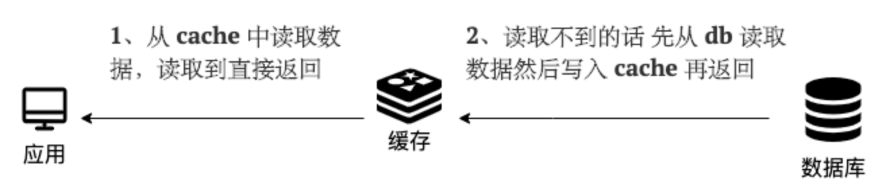
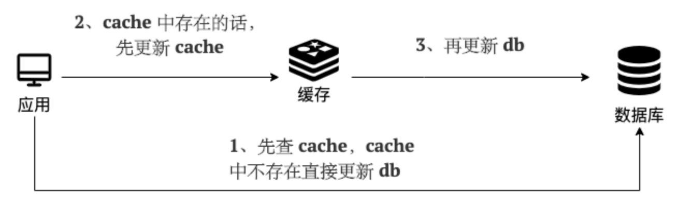

# 3. 深入解析：从核心策略到大厂架构的缓存设计详解

## 目录
*   [前言](#前言)
*   [1. 旁路缓存模式 (Cache-Aside Pattern)](#1-旁路缓存模式-cache-aside-pattern)
    *   [读操作流程](#读操作流程)
    *   [写操作流程](#写操作流程)
    *   [优缺点总结](#优缺点总结)
*   [2. 读写穿透模式 (Read/Write-Through Pattern)](#2-读写穿透模式-readwrite-through-pattern)
    *   [读操作流程 (Read-Through)](#读操作流程-read-through)
    *   [写操作流程 (Write-Through)](#写操作流程-write-through)
    *   [优缺点总结](#优缺点总结-1)
*   [3. 异步写入模式 (Write-Behind Pattern)](#3-异步写入模式-write-behind-pattern)
    *   [读操作流程](#读操作流程-1)
    *   [写操作流程](#写操作流程-1)
    *   [优缺点总结](#优缺点总结-2)
    *   [适用场景](#适用场景)
*   [核心策略总结对比](#核心策略总结对比)
*   [4. 架构进阶：大厂高并发缓存设计](#4-架构进阶大厂高并发缓存设计)
    *   [前言：为什么不能直连数据库？](#前言为什么不能直连数据库)
    *   [核心模式：以“缓存+MQ”为核心的异步策略](#核心模式以缓存mq为核心的异步策略)
    *   [核心问题解答](#核心问题解答)
    *   [补充：经典缓存“三大难题”与解决方案](#补充经典缓存三大难题与解决方案)
*   [5. 架构深度剖析：经典问题追问与解答](#5-架构深度剖析经典问题追问与解答)
    *   [Q1: 异步写模式下，还会有“缓存三兄弟”问题吗？](#q1-异步写模式下还会有缓存三兄弟问题吗)
    *   [Q2: 关于简历服务的LRU、大对象存储与实现](#q2-关于简历服务的lru大对象存储与实现)
    *   [Q3: 布隆过滤器深度解析与应用扩展](#q3-布隆过滤器深度解析与应用扩展)
    *   [Q4: 缓存击穿、雪崩与Sentinel原理辨析](#q4-缓存击穿雪崩与sentinel原理辨析)

---

## 前言

在现代应用架构中，缓存是提升系统性能、扛住高并发的必备利器。当我们谈论使用 Redis 或其他缓存中间件时，不仅仅是简单地调用 `set` 和 `get` 命令。如何设计缓存的读写策略，保证缓存和数据库之间的数据一致性，是衡量我们是否真正“熟练使用缓存”的关键。

不同的业务场景对性能、数据一致性的要求截然不同，因此也催生了不同的缓存读写策略。没有“最好”的策略，只有“最适合”的策略。理解它们的原理和优缺点，才能在实际工作中游刃余游。

本文将深入探讨三种最核心的缓存读写策略，并进一步延伸至超高并发场景下的大厂缓存架构设计哲学。

---

## 1. 旁路缓存模式 (Cache-Aside Pattern)

这是我们在实际开发中**应用最广泛**的一种策略。它的核心思想是：**应用服务作为“中间人”，全权负责维护数据库和缓存的数据，缓存只起到“旁路”的加速作用。**

### 读操作流程

读操作的逻辑非常直观：**先读缓存，缓存没有再读数据库，然后把数据放入缓存。**

1.  应用收到读请求。
2.  应用首先查询缓存，看数据是否存在。
3.  **缓存命中 (Hit)**：太棒了！直接从缓存中取数据并返回给客户端。
4.  **缓存未命中 (Miss)**：
    a. 应用转而向数据库发起查询。
    b. 从数据库中获取数据。
    c. **将数据写入缓存**，方便下一次读取。
    d. 将数据返回给客户端。


**伪代码示例:**

```java
public Data getData(String key) {
    // 1. 先从缓存读取
    Data data = cache.get(key);
    if (data != null) {
        // 缓存命中，直接返回
        return data;
    }
    
    // 2. 缓存未命中，从数据库读取
    data = db.query(key);
    if (data != null) {
        // 3. 将数据写入缓存
        cache.set(key, data);
    }
    
    return data;
}
```

### 写操作流程

写操作是旁路缓存模式的精髓和“考点”，核心在于如何保证数据一致性。正确的做法是：**先更新数据库，再删除缓存。**

1.  应用收到写请求（新增、更新、删除）。
2.  应用直接操作**数据库**，完成数据更新。
3.  应用向缓存发送**删除**命令，删除对应的缓存键。


#### 关键问题剖析

**Q1：为什么是“删除”缓存，而不是“更新”缓存？**

这是一个非常高频的面试题。主要原因有两点：

1.  **性能和懒加载**：假设一个缓存数据关联了复杂的计算或多个数据库表的查询。如果每次更新都去重新计算并写入缓存，那么开销会很大。而很多时候，被更新的数据可能在未来很长一段时间内都不会被访问。直接删除，可以将缓存的计算和加载推迟到下一次真正需要它的时候（读操作时），这是一种“懒加载”思想，可以节省不必要的计算和I/O资源。
2.  **保证数据正确性**：在复杂的业务中，更新数据库的一个字段，可能会影响到多个缓存。例如，更新了用户状态，可能会影响用户信息缓存、好友列表缓存等。如果选择更新缓存，你需要精确地知道所有受影响的缓存并逐一更新，这很容易出错或遗漏，导致数据不一致。而“删除”操作，只需要保证相关缓存键被删除即可，逻辑更简单，也更不容易出错。

**Q2：为什么是“先更新数据库，再删除缓存”？顺序能反过来吗？**

**绝对不能！** 如果采用“先删除缓存，再更新数据库”的顺序，会引入一个经典的并发问题，导致缓存与数据库数据**长期不一致**。

设想以下场景：

-   **线程A** (写操作): 要把数据 `X` 的值从 1 改为 2。
-   **线程B** (读操作): 要读取数据 `X`。

执行流程如下：

1.  `T1`: **线程A** (写) 过来，**先删除了缓存**中的 `X`。
2.  `T2`: **线程B** (读) 过来，发现缓存中没有 `X`，于是去**数据库**中读取，此时读到的是**旧值 1**。
3.  `T3`: **线程B** 将从数据库读到的**旧值 1** 写入了**缓存**。
4.  `T4`: **线程A** (写) 将**新值 2** 写入了**数据库**。

**灾难发生了**：此时，数据库中的值是 2，而缓存中的值是 1。数据彻底不一致了！后续所有的读请求都会命中缓存，读到的都是脏数据，直到这个缓存过期或被下一次写操作删除。

**Q3：“先更新数据库，再删除缓存”就万无一失了吗？**

理论上，依然存在一个极端情况下的并发问题，但发生的概率极低。

设想以下场景：

-   **线程A** (读操作): 要读取数据 `X`。
-   **线程B** (写操作): 要把数据 `X` 的值从 1 改为 2。
-   前提：`X` 在缓存中不存在。

执行流程如下：

1.  `T1`: **线程A** (读) 发现缓存没有 `X`，于是去**数据库**读取，读到**旧值 1**。
2.  `T2`: **线程B** (写) 过来，将**新值 2** 写入**数据库**。
3.  `T3`: **线程B** (写) **删除缓存**中的 `X`。（实际上此时缓存中也没有 `X`，所以这个操作是空操作）。
4.  `T4`: **线程A** (读) **将之前读到的旧值 1 写入了缓存**。

最终，数据库中的值是 2，缓存中的值是 1，数据还是不一致了。

但是，要触发这个条件非常苛刻：
- 必须是读操作（A）在写操作（B）之前开始，但却在写操作之后才完成缓存写入。
- 这意味着，一次数据库的读操作（A）加上一次缓存的写操作（A），其总耗时要**长于**一次数据库的写操作（B）加上一次缓存的删除操作（B）。
- 在现代计算中，数据库的写操作通常比读操作慢得多。因此，这种情况在现实中**概率极低**，属于理论上的风险。

为了应对这种极端情况或保证更强的一致性，可以引入**消息队列**进行**删除重试**，或者使用后续介绍的其他策略。但在绝大多数场景下，**“先更新DB，再删除缓存”是旁路缓存模式的最佳实践。**

### 优缺点总结

*   **优点**：
    *   逻辑简单，易于实现。
    *   读写操作分离，缓存和数据库的耦合度低。
    *   缓存服务如果宕机，应用仍然可以直接读写数据库，系统具有一定的“降级”能力。
*   **缺点**：
    *   **首次请求延迟**：对于新数据或冷数据，第一次读取必然会发生缓存未命中，需要访问数据库，导致延迟较高。这个问题可以通过**缓存预热**来缓解。
    *   **写操作频繁时性能下降**：如果一个数据被频繁地更新，会导致缓存被频繁地删除，使得读请求的缓存命中率下降。

---

## 2. 读写穿透模式 (Read/Write-Through Pattern)

这种模式将缓存视为**主要的数据存储**。应用层在读写时**只与缓存交互**，完全不关心底层数据库的存在。由**缓存服务**自己负责与数据库进行数据同步。

### 读操作流程 (Read-Through)

应用只管向缓存要数据，缓存自己搞定一切。

1.  应用向缓存服务发起读请求。
2.  缓存命中，直接返回数据。
3.  缓存未命中，由**缓存服务**自己向数据库发起查询。
4.  缓存服务获取数据后，**先写入缓存**，再返回给应用。

这个过程对应用层是**透明**的。应用开发者感觉不到数据库的存在。


### 写操作流程 (Write-Through)

应用只管把数据写入缓存，缓存自己负责同步写到数据库。

1.  应用向缓存服务发起写请求。
2.  缓存服务检查数据是否存在。（通常会先写入缓存）
3.  缓存服务**同步地**将数据写入**数据库**。
4.  数据库写入成功后，缓存服务再向应用确认写操作完成。



### 关键点

-   **实现依赖**：这个模式需要一个支持“穿透”功能的缓存产品。我们常用的 Redis 和 Memcached 本身并不直接支持这个功能。它通常需要结合一个实现了特定数据访问接口（如 JSR-107 JCache）的缓存库或框架来实现。
-   **同步写入**：Write-Through 的核心在于其写操作是**同步**的，即必须等到缓存和数据库都写入成功后，才算完成。

### 优缺点总结

*   **优点**：
    *   **应用逻辑简单**：应用层代码被大大简化，只需与缓存打交道。
    *   **数据一致性强**：由于写操作是同步的，可以保证缓存和数据库之间的数据始终一致。
*   **缺点**：
    *   **写性能较低**：每次写操作都需要同步等待数据库写入完成，增加了请求的延迟。
    *   **实现复杂**：需要缓存服务本身提供支持，通用性不如旁路缓存。

---

## 3. 异步写入模式 (Write-Behind Pattern)

也叫**回写模式**。它和读写穿透模式非常相似，唯一的区别在于：**写操作是异步的**。

### 读操作流程

与读写穿透模式完全一致。

### 写操作流程

应用把数据写入缓存后，立刻就能得到响应。

1.  应用向缓存服务发起写请求。
2.  缓存服务直接将数据写入缓存（或一个内部队列），并**立即**向应用返回成功。
3.  缓存服务**异步地**、**批量地**或**延时地**将数据写入数据库。


这个模式在生活中很常见，比如我们用 Word 写文档，每次 `Ctrl+S` 保存，实际上是先写入了内存（相当于Cache），然后操作系统会在后台异步地刷到硬盘（相当于DB）上，所以保存操作感觉非常快。

### 优缺点总结

*   **优点**：
    *   **写性能极高**：写请求无需等待数据库，响应速度极快，能够应对极高的写并发。
    *   **数据库压力小**：可以将多次写操作合并为一次批量写入，大大降低了数据库的压力。
*   **缺点**：
    *   **数据可能丢失**：由于是异步写入，如果缓存服务在写入数据库前宕机，那么最近的这部分数据就会**永久丢失**。
    *   **数据一致性弱**：数据库的数据在一段时间内是“旧”的，只有最终写入成功后才会同步。这对于一致性要求高的业务是不可接受的。

### 适用场景

-   **高并发写，但对数据一致性要求不高的场景**。例如：
    -   网站文章的点赞数、收藏数、浏览量统计。
    -   日志记录、监控指标上报。
-   MySQL 的 `Innodb Buffer Pool` 实际上也采用了类似的思想，修改数据时先写 `redo log` 和更新内存页，后续再由后台线程将“脏页”刷回磁盘。

---

## 核心策略总结对比

| 特性 | 旁路缓存 (Cache-Aside) | 读写穿透 (Read/Write-Through) | 异步写入 (Write-Behind) |
| :--- | :--- | :--- | :--- |
| **数据一致性** | 最终一致（有短暂不一致风险） | 强一致（同步写入） | 弱一致（数据可能丢失） |
| **读性能** | 高 | 高 | 高 |
| **写性能** | 中等（直接写DB） | 低（同步等待DB） | **非常高**（异步写DB） |
| **实现复杂度** | **应用层**需要维护两者逻辑 | 依赖**缓存库**支持，应用层简单 | 依赖**缓存库**支持，实现复杂 |
| **数据丢失风险** | 低 | 低 | **高** |
| **常见使用者** | **绝大多数互联网应用** | 需要强一致性的特定系统 | 日志、计数等写密集型系统 |

---

## 4. 架构进阶：大厂高并发缓存设计

### 前言：为什么不能直连数据库？

当你面对一个日活数亿的应用时，传统"应用-数据库"的架构模式会瞬间崩溃。原因很简单：

1.  **连接数瓶颈**：数据库能支撑的并发连接数是有限的，在高并发流量下，连接池会瞬间被打满、耗尽。
2.  **磁盘I/O瓶颈**：数据库的核心操作是读写磁盘，而磁盘I/O的速度与内存读写有几个数量级的差距。即使有索引优化，也无法满足海量、实时的读写需求。
3.  **扩展性瓶颈**：数据库的水平扩展（分库分表）非常复杂，成本高昂，且难以做到平滑的线性扩展。

因此，大厂普遍采用的核心架构思想是：**将缓存推到最前端，作为主要的数据访问层，而数据库则退居二线，承担最终数据持久化的角色。** 应用服务尽可能只与缓存交互，实现极致的性能。

### 核心模式：以“缓存+MQ”为核心的异步策略

在如此庞大的体系中，不存在单一的“银弹”。架构是演进而来的，是多种策略的组合。但对于核心的写入场景，**异步写入 (Write-Behind)** 模式是其灵魂。

然而，单纯的Write-Behind存在数据丢失的风险。因此，大厂对其进行了增强，形成了以**“缓存 + 消息队列(MQ)”**为核心的异步架构。

**标准流程如下：**

1.  **写请求**：应用服务接收到写请求（如用户发了一条新视频、修改了昵称）。
2.  **写缓存**：服务**立即更新Redis缓存**中的数据，确保后续的读请求能马上看到最新状态。
3.  **发消息**：服务将需要持久化的数据封装成一条消息，发送到**消息队列**（如Kafka、RocketMQ）中。
4.  **立即返回**：消息成功发送到MQ后，应用服务就可以**立即向客户端返回成功**。用户体验极佳，感觉操作是“秒成功”。
5.  **异步消费**：一个独立的、与核心业务逻辑解耦的**数据消费服务**，会订阅MQ中的消息。
6.  **持久化入库**：消费服务按照自己的节奏，从MQ中拉取消息，然后**批量、平稳地写入后端数据库**（如MySQL、HBase）。


这种架构完美地解决了性能与数据可靠性之间的矛盾：
- **高性能**：核心服务只操作内存（Redis）和MQ，响应速度极快。
- **高可靠**：MQ本身是持久化、高可用的，确保了即使消费服务或数据库暂时宕机，数据也不会丢失，待其恢复后可以继续消费处理。
- **削峰填谷**：面对流量洪峰（如热点事件），MQ像一个巨大的蓄水池，保护了后端的数据库不被冲垮。

### 核心问题解答

#### 1. 7亿用户的核心数据都在内存里吗？Redis如何扩展？

**答案是否定的，缓存的是热点数据，通过集群分片来扩展。**

-   **热点数据驱动**：缓存中只存放“热”数据。对于用户服务，这通常意味着**当前在线或近期活跃的用户**。一个7亿DAU的应用，同时在线的峰值可能在几千万级别。系统会通过LRU/LFU等算法，动态地将不活跃的“冷”用户数据从缓存中淘汰出去。
-   **水平扩展（分片集群）**：单个Redis实例的内存和QPS是有限的。为了支撑海量数据，Redis会以**集群模式**部署。数据通过一致性哈希等算法**分片(Sharding)**到不同的节点上。例如，用户ID为`1-1000万`的数据在节点A，`1001-2000万`在节点B... 整个集群可以由成百上千个Redis节点组成，通过简单地增加节点数量，就能实现容量和性能的线性扩展。这比MySQL的分库分表要灵活和简单得多。

#### 2. Redis和MySQL用什么组件同步？

如上所述，**消息队列（Message Queue）是业界标准答案**。

-   **为什么是MQ？**
    -   **异步解耦**：将核心业务（面向用户）与数据持久化业务（面向数据库）彻底分开。
    -   **可靠性**：主流MQ（如Kafka）的数据是持久化的，支持多副本，保证消息不丢失。
    -   **缓冲能力**：强大的消息堆积能力，可以作为前端流量和后端处理能力之间的缓冲层。
    -   **可观测性**：可以方便地监控消息的生产、堆积和消费情况。

#### 3. Redis集群断电/宕机，数据丢失怎么办？

这是一个系统性的工程问题，通过**持久化 + 高可用 + 灾备**三层体系来保障。

1.  **持久化层**：生产环境的Redis**必须开启持久化**。
    -   **RDB (Snapshotting)**：定期将内存中的数据快照保存到磁盘。适合做数据备份和灾难恢复。
    -   **AOF (Append Only File)**：记录所有写操作命令。数据安全性更高，最多只会丢失最后1秒的数据。
    -   **混合持久化**：在Redis 4.0之后，推荐使用RDB和AOF的混合模式，兼顾了快速恢复和高数据安全性的优点。

2.  **高可用层**：防止单点故障。
    -   **主从复制 (Master-Slave Replication)**：每个主节点(Master)都至少有一个或多个从节点(Slave)实时同步数据。
    -   **哨兵/集群自动故障转移 (Sentinel/Cluster Failover)**：当Master节点宕机时，哨兵或集群内置的投票机制会自动将一个Slave节点提升为新的Master，整个过程对应用层是透明的，可以实现秒级恢复。

3.  **灾备层**：应对机房级别的故障。
    -   **同城多活**：在同一个城市的不同机房部署多套集群。
    -   **异地灾备**：在相隔数百甚至数千公里的不同城市部署灾备集群，通过专线同步核心数据，用于应对地震、海啸等区域性灾难。

---

### 补充：经典缓存“三大难题”与解决方案

除了上述架构设计，日常运维中还需要处理以下经典缓存问题：

#### 1. 缓存穿透 (Cache Penetration)
-   **现象**：黑客或恶意用户用**不存在的**数据ID（缓存和数据库里都没有）发起大量请求。这会导致所有请求都绕过缓存，直接打到数据库上，可能导致数据库崩溃。
-   **解决方案**：
    -   **缓存空对象**：如果查询数据库后发现数据不存在，也在缓存中存一个特殊的空值（如`null`），并设置一个较短的过期时间。
    -   **布隆过滤器 (Bloom Filter)**：在访问缓存之前，先通过布隆过滤器判断数据是否存在。布隆过滤器能高效地判断一个元素“一定不存在”，从而在第一层就拦截掉绝大多数恶意请求。

#### 2. 缓存击穿 (Cache Breakdown)
-   **现象**：某一个**极热点**的数据（如秒杀商品、头条新闻）的缓存key在某一瞬间**突然失效**，导致成千上万的并发请求在同一时刻全部涌向数据库，造成数据库压力剧增。
-   **解决方案**：
    -   **分布式锁**：当缓存未命中时，使用分布式锁（如Redisson）来控制，只允许第一个请求去查询数据库并回写缓存，其他请求则等待或返回一个友好提示。
    -   **热点数据永不过期**：对极热点的数据，不设置过期时间，由后台服务异步地更新。

#### 3. 缓存雪崩 (Cache Avalanche)
-   **现象**：**大量**的缓存key在**同一时间**集体失效，或者Redis集群整体发生故障，导致绝大多数请求都直接打向数据库。
-   **解决方案**：
    -   **过期时间加随机值**：在设置缓存的过期时间时，在一个基础时间上增加一个随机数（如`30分钟 + random(1-5)分钟`），避免所有key在同一时刻集体过期。
    -   **构建高可用集群**：通过主从+哨兵/集群模式，避免Redis单点故障。
    -   **服务降级与熔断**：在缓存层出现问题时，通过服务治理框架（如Sentinel）对下游的数据库访问进行降级（如返回兜底数据、暂时关闭非核心功能）或熔断，保护数据库不被彻底压垮。

通过以上综合手段，才能构建一个真正稳定、高效、可靠的亿级用户服务体系。

---

## 5. 架构深度剖析：经典问题追问与解答

本章节将我们之前讨论的一些深度问题进行整理，作为对前面知识的深化和补充。

### Q1: 异步写模式下，还会有“缓存三兄弟”问题吗？

**答案是：会，一个都不会少。**

这是一个非常关键的认知。**异步写入（Write-Behind）模式主要优化的是“写”链路的性能和用户体验**。它通过将数据持久化这个慢操作异步化，让“写”操作能够极快地返回。

然而，**缓存穿透、击穿、雪崩这三个问题，本质上都是“读”链路上，因为各种原因导致缓存没能挡住请求（Cache Miss），最终流量打到数据库上的问题。**

-   **缓存穿透**：读一个**压根不存在**的数据。这和你是同步写还是异步写毫无关系，反正这个key就没写入过。
-   **缓存击穿**：读一个**刚过期**的热点数据。这也和写策略无关，过期策略是独立于写策略的。
-   **缓存雪崩**：**大量key同时过期**或**缓存服务宕机**。这同样是读链路的问题。

**结论：** 优化写链路，并不能解决读链路上的缓存失效问题。无论后端架构多么先进，面向用户的缓存层永远要做好这“三防”工作。

### Q2: 关于简历服务的LRU、大对象存储与实现

#### a) Redis如何实现LRU？

你完全不需要自己实现LRU算法，**Redis原生就内置了LRU在内的多种内存淘汰策略**，我们只需要通过配置来“开箱即用”。

在Redis的配置文件 `redis.conf` 中，有两个关键参数：

1.  `maxmemory <bytes>`：设置Redis能使用的最大内存量。一旦内存使用达到这个阈值，Redis就会开始根据淘汰策略来删除数据。
2.  `maxmemory-policy <policy>`：设置淘汰策略。和LRU相关的主要是：
    *   `volatile-lru`：只在设置了过期时间（expire）的key中，进行LRU淘汰。
    *   `allkeys-lru`：在所有的key中，进行LRU淘汰。**这通常是我们想要的策略，它会淘汰掉全局最久未被访问的数据。**

所以，你不需要在代码里维护任何LRU数据结构，Redis底层已经帮你完美实现了。

#### b) 简历这种大对象，Redis里到底存什么？

你的直觉完全正确！**把包含大量文字的、完整的简历JSON直接塞进一个Redis key里，是非常糟糕的设计。** 大厂绝对不会这么干。原因如下：

*   **网络开销大**：一次`GET`操作可能传输几十KB甚至上百KB数据，严重浪费带宽。
*   **序列化开销大**：服务端和客户端都需要对这个大JSON进行序列化和反序列化，消耗CPU资源。
*   **内存不经济**：你可能只是想在列表页显示用户的“姓名、公司、职位”，但却被迫把整份简历的“工作经历全文”都加载到内存里，性价比极低。

**大厂的标准做法是：数据拆分，缓存结构化、高频、短小的核心数据。**

对于你的简历服务，可以这样设计：

*   **在Redis中，使用`Hash`结构存储简历的“摘要信息”或“列表信息”**。
    *   Key: `resume:profile:{resume_id}` (例如: `resume:profile:80000001`)
    *   Value (Hash):
        *   `name`: "张三"
        *   `city`: "上海"
        *   `current_company`: "某某科技"
        *   `current_title`: "高级软件工程师"
        *   `update_time`: "2025-09-21 10:00:00"
        *   `avatar_url`: "http://..."
        *   `work_years`: "10"

*   **在数据库（或文档数据库如MongoDB，甚至对象存储HBase/S3）中，存储简历的完整详情**，尤其是大段的文本，如“项目经历”、“自我评价”等。

这样，当HR在搜索、刷列表时，你的服务层只需要从Redis中批量获取这些摘要信息，速度极快，开销极小。只有当HR真正点击进入某一份简历的详情页时，服务才会根据ID去数据库中加载那一份完整的、庞大的简历数据。

### Q3: 布隆过滤器深度解析与应用扩展

布隆过滤器是一个神奇的数据结构，它的核心作用是：**用极小的空间，极高的效率，告诉你一个元素“一定不存在”或者“可能存在”。**

#### a) 核心原理

想象一个很长的**位数组**（比如10000个比特位，初始全是0），和几个不同的**哈希函数**（比如3个，叫H1, H2, H3）。

1.  **录入数据（add）**:
    *   当一份新简历 `resume_id_123` 创建时，我们把它同时喂给3个哈希函数。
    *   `H1(resume_id_123)` -> `50`
    *   `H2(resume_id_123)` -> `1234`
    *   `H3(resume_id_123)` -> `8888`
    *   然后，我们到位数组中，把第 `50`、`1234`、`8888` 这三个位置的 `0` 变成 `1`。

2.  **查询数据（exists）**:
    *   当一个请求过来，要查 `resume_id_999` 时，我们同样把它喂给3个哈希函数，算出三个位置，比如 `66`、`2345`、`7777`。
    *   我们去位数组里检查这三个位置。只要发现**有任何一个位置仍然是 `0`**，我们就能**100%确定**，`resume_id_999` 从来没有被录入过。直接返回“不存在”，根本不用查缓存和数据库。
    *   如果另一个请求查 `resume_id_123`，我们算出 `50`、`1234`、`8888`，发现这三个位置**全都是 `1`**。这时我们只能说，它“**可能存在**”。为什么是“可能”？因为有可能别的ID算出来的几个位置，恰好把这三个位置都凑巧变成了1。这就是“**误判率**”（False Positive）。

#### b) 如何实现与在Java中使用？

Redis本身不直接支持，但是可以通过官方提供的**RedisBloom模块**来轻松实现。

*   **实现步骤：**
    1.  **安装模块**：在你的Redis服务器上加载RedisBloom模块 (`.so`文件)。
    2.  **数据同步**：你需要有一个机制，在简历创建时，去更新布隆过滤器。通常是简历服务在创建简历成功后，调用 `BF.ADD resumes_filter <resume_id>`。
    3.  **应用层查询**：在查询简历的入口处，第一步就是检查布隆过滤器：`BF.EXISTS resumes_filter <queried_resume_id>`。如果返回 `0`，立即返回“简历不存在”；如果返回 `1`，才继续走后面的流程。

*   **在Java服务中使用：**
    当然能用，而且非常方便。主流的Java Redis客户端如 **Redisson** 和 **Jedis** 都对RedisBloom的命令提供了很好的封装。以Redisson为例：

    ```java
    // 1. 获取布隆过滤器实例
    RBloomFilter<String> bloomFilter = redisson.getBloomFilter("resumes_filter");
    // 初始化，预计放入1亿个元素，期望误判率为0.01%
    bloomFilter.tryInit(100000000L, 0.0001); 

    // 2. 添加元素 (简历创建时)
    bloomFilter.add(newResumeId);

    // 3. 检查元素 (简历查询时)
    if (!bloomFilter.contains(queriedResumeId)) {
        log.info("布隆过滤器拦截，简历ID: {} 不存在", queriedResumeId);
        return Result.notFound("简历不存在");
    }
    // ...继续查缓存或数据库
    ```

#### c) 在简历场景下的其他应用

除了防止缓存穿透，布隆过滤器在招聘场景下还有很多妙用：

1.  **防止简历重复上传/投递**：
    *   **场景**：一个候选人可能通过不同渠道（官网、App、猎头）重复上传简历。
    *   **用法**：可以创建一个关键信息摘要（如“`手机号_邮箱`”）作为元素，加入布隆过滤器。当一份新简历进来时，先检查摘要是否存在。如果“可能存在”，则可以触发更严格的数据库比对，避免重复录入。同理，也可以防止用户向同一个职位重复投递。

2.  **推荐系统去重**：
    *   **场景**：要为HR或候选人推荐职位/简历，需要避免重复推荐已经看过的内容。
    *   **用法**：为每个用户维护一个个性化的布隆过滤器（`user_seen_resumes:{user_id}`）。在推荐列表中展示一份简历前，先用 `BF.EXISTS` 检查用户是否见过。这比为每个用户维护一个巨大的Redis Set要节省几个数量级的内存。

3.  **黑名单过滤**：
    *   **场景**：过滤已知的虚假账号、垃圾邮件发送者或有不良记录的候选人/公司。
    *   **用法**：将黑名单中的手机号、邮箱或公司ID加入一个全局的布隆过滤器。在用户注册、简历投递等环节进行前置检查，快速拦截。

### Q4: 缓存击穿、雪崩与Sentinel原理辨析

#### a) 缓存击穿 vs 缓存雪崩

你的理解完全正确，这里再次强调一下关键区别：

*   **缓存击穿**：是**“一个”**key的“单点问题”。它是一个**极热点**的key，承载着巨大的并发量，在它失效的瞬间，所有流量都打向数据库的**同一行数据**，像是把数据库“打穿”了一个洞。
*   **缓存雪崩**：是**“N个”**key的“范围问题”。它是**大量**的key在**同一时间**集体失效，导致流量分散地打向数据库的**不同数据**，像是雪崩一样，整体压力过大导致数据库瘫痪。

#### b) Sentinel原理简介

Sentinel（这里指阿里巴巴的Sentinel熔断降级组件）的核心是**“实时秒级监控”**和**“灵活的规则引擎”**。

1.  **如何知道流量大？ -> 滑动时间窗口算法**
    *   Sentinel通过AOP等方式，将你的每个接口（如 `getResumeById`）包装成一个“资源”。
    *   它在内存中为每个资源维护了一个**滑动时间窗口**。你可以把它想象成一个由多个“格子”组成的队列，每个格子代表一个很短的时间片（比如100毫秒）。
    *   每当一个请求通过，对应时间片的格子里计数就+1。时间在流逝，旧的格子会被丢掉，新的格子会补充进来。
    *   任何时刻，只要把当前窗口内所有格子的计数加起来，就能**极其精确且实时地计算出当前接口的QPS**、响应时间、异常数等。

2.  **流量大了如何降级？ -> 规则匹配与执行**
    *   你可以为每个资源配置各种规则，比如“QPS阈值=2000”、“线程数阈值=50”、“异常比例>20%”等。
    *   每个请求到来时，Sentinel都会用上面实时算出来的数据去匹配这些规则。
    *   **一旦触发规则**（比如QPS达到了2001），Sentinel就会立刻执行预设的动作，如**流控**（直接拒绝）、**降级熔断**（在一段时间内快速失败，不再调用真实逻辑），从而保护后端服务。

简单来说，Sentinel就像一个安装在你服务入口的、拥有超高精度秒表的交警。它实时地数着每条路（接口）上的车流量，一旦发现某条路堵塞了或车速过快，就立刻拿出“停止”的牌子，阻止更多的车进去，从而避免整个交通系统（后端服务）的瘫瘓。
